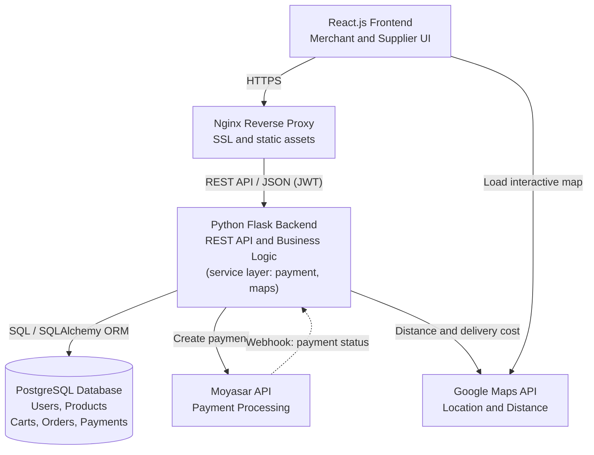

##  System Architecture

React.js frontend communicates with the Python Flask backend through REST APIs (using JSON format). The backend handles the core business logic, including the pricing calculator engine and order processing, while communicating with PostgreSQL via SQL/ORM for data management (Users, Businesses, Supplies, Costs, and Orders). Additionally, the system seamlessly integrates with external services, including Moyasar/Tap API for payment processing, Google Maps API for location-based logistics, and Supplier Services for raw material requests.

##  System Architecture



 

```
###  Architectural Decisions & Rationale

* **React.js (Single Page Application):** Provides a smooth, highly responsive UI for complex interactive modules like the Smart Pricing Calculator, live wholesale shopping cart, and location picker without triggering full-page reloads.


* **Flask RESTful API (Python):** Chosen for its lightweight footprint and modular structure. Flask simplifies the implementation of the **Facade Structural Pattern**, allowing us to isolate external integrations behind clean, reusable API controllers.


* **PostgreSQL & SQLAlchemy ORM:** Offers structured relational storage with strong ACID compliance, ensuring relational integrity across users, wholesale orders, line items, and financial calculations.


* **Nginx Reverse Proxy:** Manages SSL termination, serves compiled frontend assets, and acts as a gateway proxy to protect Flask application processes.

---

