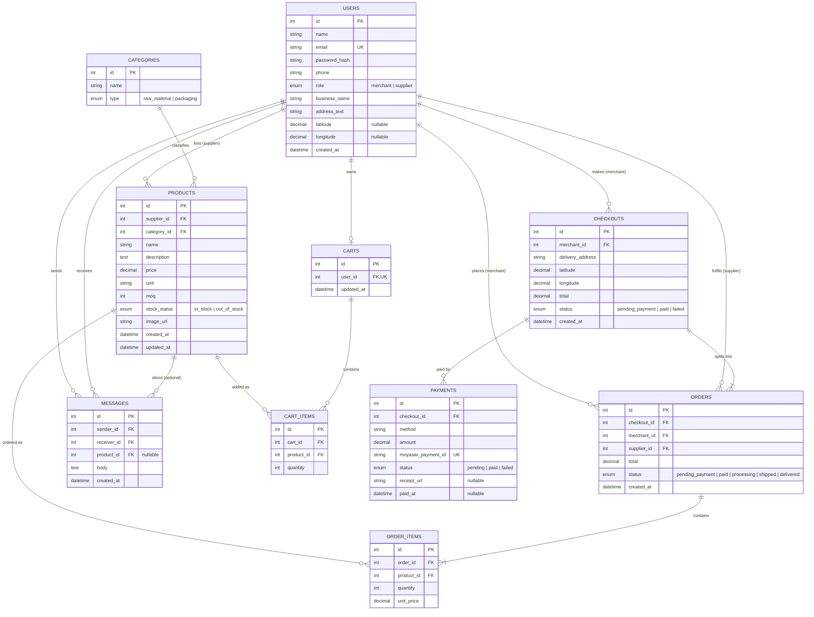
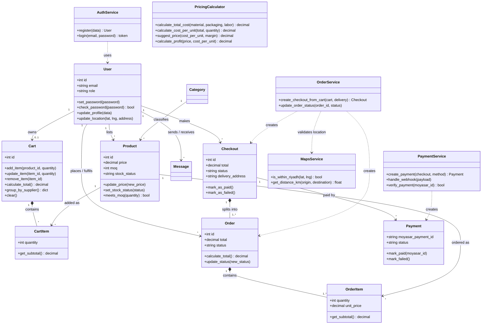

# Components, Classes & Database Design

## Overview

Maksab uses **PostgreSQL** with the **SQLAlchemy ORM**. Every table maps to one model class in the Flask backend, and every table, class, and component below exists to serve a user story from Task 0. The Smart Pricing Calculator is stateless (Saved Recipe Database is Won't Have), so it has no table.

**Naming convention:** database tables use plural names (`users`, `orders`), while the matching model classes use singular names (`User`, `Order`). This also avoids PostgreSQL reserved words (`user`, `order`).

**Cart and checkout model (marketplace style):** a Merchant can add products from several Suppliers in one cart and pays **once**. At checkout the system creates one **Checkout** (one payment) that splits into one **Order per Supplier**, so each Supplier sees and fulfils only their own order.

---

## 1. Database Design

### ER Diagram



### Table Descriptions

| Table | Purpose | Key Notes |
| :--- | :--- | :--- |
| **users** | Merchants and Suppliers in one table. | `role` separates them. Passwords hashed. Latitude/longitude are empty until the user pins a location. |
| **categories** | Product categories. | `type` is `raw_material` or `packaging`; supports the category filter. |
| **products** | Wholesale items listed by Suppliers. | `moq` is the Minimum Order Quantity. `stock_status` supports availability updates. |
| **carts** | One cart per Merchant (`user_id` is unique). | May hold products from several Suppliers. Persists across sessions. |
| **cart_items** | Products and quantities in a cart. | Unique on (`cart_id`, `product_id`); quantity changes instead of duplicating a row. |
| **checkouts** | One purchase action by a Merchant. | Holds the delivery address, pinned coordinates, grand total, and payment status. One checkout = one payment. |
| **orders** | The part of a checkout that belongs to one Supplier. | `total` is that Supplier's subtotal. Each Supplier updates only their own order status. |
| **order_items** | Line items of an order. | `unit_price` is a **snapshot**, so later price changes do not alter old orders. |
| **payments** | Moyasar transactions for a checkout. | `moyasar_payment_id` is unique to prevent duplicate processing. No card data is stored. |
| **messages** | Merchant-Supplier messages. | Created only if messaging (Could Have) is implemented. |

### Design Decisions

- **One payment, many orders.** The cart accepts products from several Suppliers. At checkout, `checkouts` records the single payment, and the cart is split into one `orders` row per Supplier. When Moyasar confirms the payment, the checkout and all its orders become `paid` together.
- **Delivery location lives on the checkout** (one address for the whole purchase). Suppliers read it through their order's `checkout_id`.
- **Receipts** are generated per checkout (one payment), listing every Supplier's items.
- **Money columns** use `NUMERIC(10,2)` (decimal), never float. Moyasar expects amounts in the smallest currency unit (halalas), so the backend converts SAR x 100 when calling the API.
- **Products referenced by orders are never hard-deleted.** Suppliers mark them `out_of_stock` instead, so order history stays valid.
- **Refunds and order cancellation are out of MVP scope.**
- **No separate Profile table:** business name, address, and coordinates live in `users`, since each user has exactly one business.
- **No card data stored:** `payments` keeps only the Moyasar payment ID and status.
- **Calculator is not stored:** it is standalone.
- **If US-19 (delivery cost, Could Have) is implemented,** add a `delivery_fee` column to `orders` (distance differs per Supplier) and set the checkout `total` to the sum of all order totals plus fees.
- **Messages** are implemented only if the messaging feature is included.

---

## 2. Backend Classes

Model classes (SQLAlchemy) represent database tables. Service classes hold business logic and wrap external APIs (Facade pattern).



### Class Descriptions

| Class | Type | Description |
| :--- | :--- | :--- |
| **User** | Model | A Merchant or Supplier account (identified by `role`) with business profile and optional pinned location. |
| **Category** | Model | A product category: raw material or packaging. |
| **Product** | Model | A wholesale item listed by a Supplier, with price, unit, MOQ, and stock status. |
| **Cart** | Model | A Merchant's cart; may hold products from several Suppliers. |
| **CartItem** | Model | One product and quantity inside a cart. |
| **Checkout** | Model | One purchase action with one delivery location and one payment. Splits into one Order per Supplier. |
| **Order** | Model | The part of a checkout that belongs to a single Supplier, with its own status. |
| **OrderItem** | Model | A line item of an order, with the price at purchase time. |
| **Payment** | Model | A Moyasar payment attempt for a checkout (ID and status only, no card data). |
| **Message** | Model | A message between a Merchant and a Supplier (Could Have). |
| **AuthService** | Service | Handles registration and login, and issues the JWT token. |
| **OrderService** | Service | Turns a cart into a checkout and per-Supplier orders; updates order status. |
| **PaymentService** | Service | Wraps Moyasar: creates payments, handles the webhook, and verifies payments. |
| **MapsService** | Service | Wraps Google Maps: Riyadh boundary check and distance. |
| **PricingCalculator** | Service | Computes cost per unit, suggested price, and profit per unit (stateless). |

### Key Behaviors

| Class | Method | What it does |
| :--- | :--- | :--- |
| **Cart** | `add_item` | Rejects a quantity below the product's MOQ and an out-of-stock product. Accepts products from any Supplier. |
| **Cart** | `group_by_supplier` | Groups items by Supplier so the cart can show a subtotal per Supplier. |
| **OrderService** | `create_checkout_from_cart` | Validates the location, creates one `Checkout`, and creates one `Order` per Supplier group with price-snapshot items. Status starts as `pending_payment`. |
| **PaymentService** | `handle_webhook` | Receives the Moyasar notification. |
| **PaymentService** | `verify_payment` | Fetches the payment from Moyasar and checks status and amount against the checkout. Only then is `Checkout.mark_as_paid()` called, which marks all its orders `paid` and clears the cart. The webhook payload alone is never trusted. |
| **MapsService** | `is_within_riyadh` | Rejects pins outside Riyadh (US-14). |

### Pricing Formulas

`margin` is a percentage of the **selling price**. Requires `quantity > 0` and `0 <= margin < 100`.

```text
total_cost      = material + packaging + labor
cost_per_unit   = total_cost / quantity
suggested_price = cost_per_unit / (1 - margin / 100)
profit_per_unit = suggested_price - cost_per_unit
```

The calculator therefore needs a **quantity** input (units produced in the batch) in addition to the three costs and the margin.

---

## 3. Frontend Components (React)

| Component | Purpose | API used | Stories |
| :--- | :--- | :--- | :--- |
| `AuthContext` | Holds logged-in user/token and protects routes by role | `POST /api/auth/login` | US-02 |
| `RegisterForm`, `LoginForm` | Registration with role selection, and login | `/api/auth/*` | US-01, 02 |
| `ProfileForm` | Edit business name, contact info, address | `GET/PUT /api/profile` | US-03 |
| `SearchBar`, `FilterPanel` | Search by name; filter by category and price | `GET /api/products` | US-08, 09 |
| `ProductList`, `ProductCard` | Display product summaries | none | US-08 |
| `ProductDetailPage` | Full details, MOQ check, Add to Cart | `GET /api/products/{id}`, `POST /api/cart/items` | US-10 |
| `CartPage` | Items grouped by Supplier with subtotals; edit quantities, remove items, live grand total | `/api/cart`, `/api/cart/items/{id}` | US-11 |
| `PricingCalculatorPage` | Cost inputs and margin; shows price and profit | `POST /api/calculator/price` | US-12, 13 |
| `LocationPicker` | Google Map with draggable pin (Riyadh only) | Google Maps API | US-14 |
| `CheckoutPage`, `PaymentForm` | Summary per Supplier, location, one Moyasar payment (card details go directly to Moyasar, never through Flask) | `POST /api/checkouts`, `POST /api/checkouts/{id}/payment` | US-14, 15 |
| `OrderHistoryPage` | Past orders, payment status, receipts | `GET /api/orders` | US-16, 17 |
| `ProductManager`, `ProductForm` | Supplier creates/edits products | `POST/PUT /api/products` | US-04, 05 |
| `SupplierOrders` | Supplier views own orders and updates status | `GET /api/orders`, `PUT /api/orders/{id}/status` | US-06, 07 |
| `MessagesPage` | Merchant-Supplier chat (Could Have) | messaging endpoints | US-20 |

All API calls go through one `api.js` service that attaches the token and handles errors. Merchant and Supplier pages are protected by role.

---

## 4. Design Justifications

| Decision | Justification |
| :--- | :--- |
| PostgreSQL (relational) | Data is highly relational, and orders and payments need ACID transactions. Foreign keys and CHECK constraints enforce integrity. |
| Single `users` table with `role` | Merchants and Suppliers share login and profile fields, which keeps authentication simple. |
| Multi-supplier cart with one payment | Matches how marketplaces work: the Merchant pays once, and each Supplier still gets an independent order. |
| `checkouts` table | Separates the payment (one per purchase) from fulfilment (one per Supplier), so a single payment can cover several Suppliers. |
| One order per Supplier | Each Supplier fulfils and tracks only their own items. |
| `unit_price` snapshot | Order history and receipts stay accurate after price changes. |
| Separate `payments` table | A checkout can have several payment attempts (failed, then successful). |
| Service classes (Facade) | Keeps Moyasar, Maps, and calculator logic out of routes and easy to test with Pytest. |
| Server-side payment verification | Prevents faked payments; orders are paid only after Moyasar confirms. |
| Component-based React UI | Reusable components and no page reloads for cart, calculator, and map. |

---

## 5. Traceability: User Stories to Design

| User Story | Priority | Tables | Classes | Frontend Components |
| :--- | :--- | :--- | :--- | :--- |
| US-01 Register | Must | users | User, AuthService | RegisterForm |
| US-02 Login / logout | Must | users | User, AuthService | LoginForm, AuthContext |
| US-03 Profile | Should | users | User | ProfileForm |
| US-04 List products | Must | products, categories | Product, Category | ProductForm |
| US-05 Update price / stock | Should | products | Product | ProductManager |
| US-06 View incoming orders | Must | orders, order_items | Order | SupplierOrders |
| US-07 Update order status | Should | orders | Order, OrderService | SupplierOrders |
| US-08 Search | Must | products | Product | SearchBar, ProductList |
| US-09 Filter | Should | products, categories | Product, Category | FilterPanel |
| US-10 Product details | Must | products | Product | ProductDetailPage |
| US-11 Cart | Must | carts, cart_items | Cart, CartItem | CartPage |
| US-12 Cost calculation | Must | none (stateless) | PricingCalculator | PricingCalculatorPage |
| US-13 Suggested price | Must | none (stateless) | PricingCalculator | PricingCalculatorPage |
| US-14 Pin location | Must | users, checkouts | MapsService | LocationPicker |
| US-15 Pay with Moyasar | Must | checkouts, payments, orders | Checkout, Payment, PaymentService | CheckoutPage, PaymentForm |
| US-16 Order history | Must | orders, order_items, checkouts | Order, Checkout | OrderHistoryPage |
| US-17 Receipt | Should | payments, checkouts | Payment | OrderHistoryPage |
| US-18 Nearby suppliers | Should | users | MapsService | ProductList (sort by distance) |
| US-19 Delivery cost | Could | orders (`delivery_fee`) | MapsService | CheckoutPage |
| US-20 Messaging | Could | messages | Message | MessagesPage |
