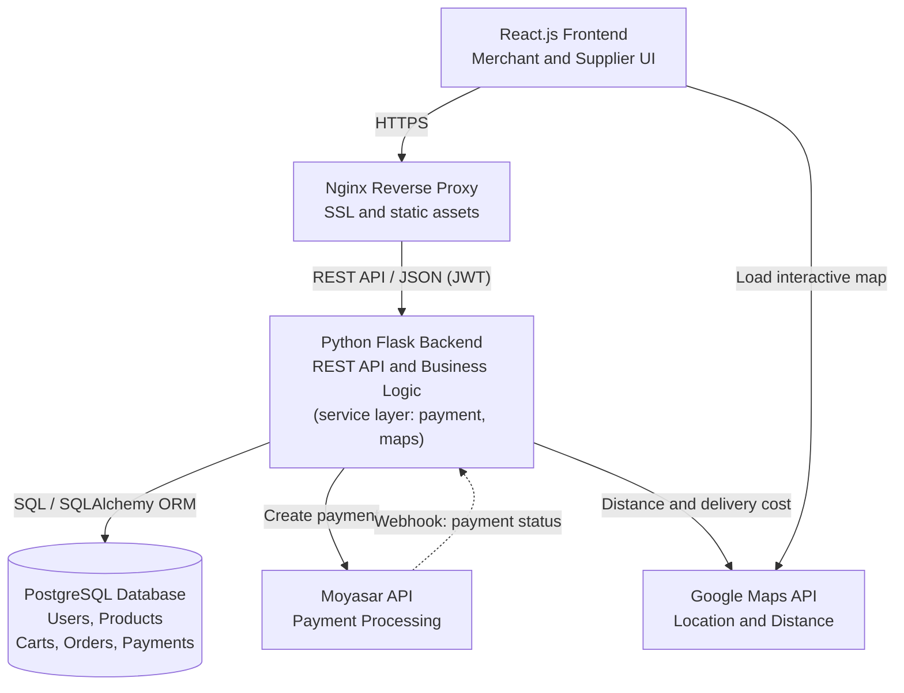

System Architecture


```mermaid
flowchart TB
    FE["React.js Frontend<br/>Merchant and Supplier UI"]
    NGINX["Nginx Reverse Proxy<br/>SSL and static assets"]
    BE["Python Flask Backend<br/>REST API and Business Logic<br/>(service layer: payment, maps)"]
    DB[("PostgreSQL Database<br/>Users, Products<br/>Carts, Orders, Payments")]
    PAY["Moyasar API<br/>Payment Processing"]
    MAPS["Google Maps API<br/>Location and Distance"]

    FE -->|"HTTPS"| NGINX
    NGINX -->|"REST API / JSON (JWT)"| BE
    BE -->|"SQL / SQLAlchemy ORM"| DB
    BE -->|"Create payment"| PAY
    PAY -.->|"Webhook: payment status"| BE
    BE -->|"Distance and delivery cost"| MAPS
    FE -->|"Load interactive map"| MAPS
```

 

```
## 2. System Architecture
```

بعد ما ترفعونه على GitHub، افتحوا الصفحة وتأكدوا إن الرسمة طلعت. وإذا طلع خطأ، صوروه لي وأصلحه.
