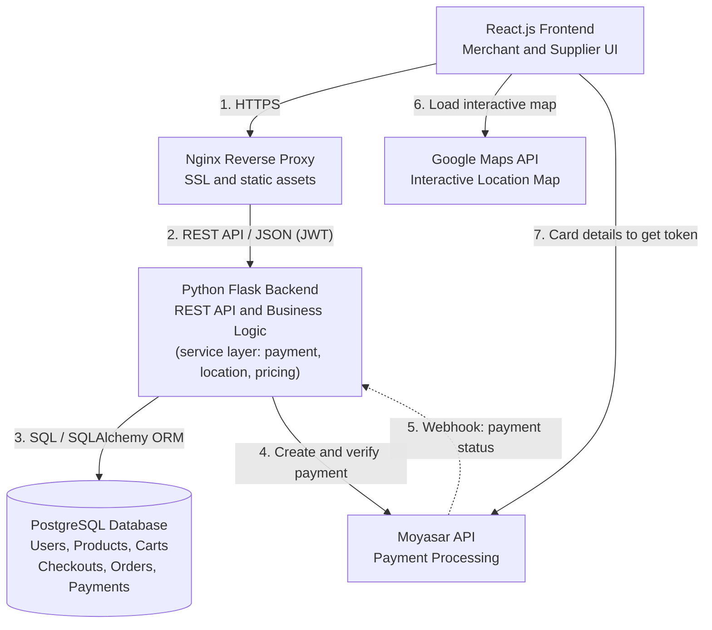

# 2. System Architecture

## Overview

Maksab follows a **three-tier architecture**: a React single-page application (SPA), a Flask REST API backend, and a PostgreSQL database. **Nginx** sits in front as a reverse proxy. Two external services are integrated: **Moyasar** for payments and **Google Maps Platform** for location services. The Frontend and Backend communicate through secure JSON REST APIs.

## Architecture Diagram

## Data Flow

| # | From | To | Data |
| :--- | :--- | :--- | :--- |
| 1 | Frontend | Nginx | Every user action is an HTTPS request. Nginx also serves the compiled React files. |
| 2 | Nginx | Flask Backend | JSON REST requests with a JWT token that identifies the user and role. The Backend returns JSON. |
| 3 | Backend | PostgreSQL | Users, products, carts, checkouts, orders, and payments, accessed through the SQLAlchemy ORM. |
| 4 | Backend | Moyasar | Create a payment for a checkout, then fetch it again to verify status and amount. |
| 5 | Moyasar | Backend | Webhook (dashed arrow) notifying that a payment changed status. Orders become `paid` only after the Backend verifies it. |
| 6 | Frontend | Google Maps | Interactive map where the Merchant pins the delivery location. |
| 7 | Frontend | Moyasar | Card details go directly to Moyasar and return a token, so they never pass through our Backend. |

## Component Responsibilities

| Component | Responsibility |
| :--- | :--- |
| **React Frontend (SPA)** | UI for both roles, form validation, and API calls through one Axios service that attaches the JWT. |
| **Nginx** | SSL termination, serving compiled frontend assets, and acting as a gateway proxy in front of Flask. |
| **Flask Backend** | Routing, JWT authentication, role and ownership checks, and business logic organized in model classes and service classes (Auth, Order, Payment, Location rules, Pricing Calculator). |
| **PostgreSQL** | Relational storage with ACID transactions for users, orders, and payments. |
| **Moyasar** | Online payments (sandbox mode in the MVP) and payment webhooks. |
| **Google Maps** | Interactive map where the Merchant pins the delivery location. Maksab does not run delivery: Suppliers arrange delivery themselves. |

## Architectural Decisions and Rationale

- **React (Single Page Application):** a smooth, responsive UI for interactive modules such as the Smart Pricing Calculator, the live cart, and the location picker, without full-page reloads.
- **Flask RESTful API (Python):** lightweight and modular. It makes it easy to isolate external integrations behind clean service classes (Facade pattern), such as `PaymentService` for Moyasar. A `MapsService` holds the location rules (Riyadh boundary check).
- **PostgreSQL with SQLAlchemy ORM:** structured relational storage with strong ACID compliance, which keeps users, orders, order items, and payments consistent.
- **Nginx reverse proxy:** manages SSL, serves the compiled frontend, and protects the Flask application processes.
- **Modular monolith:** one deployable backend with separated modules, which fits a 4-person MVP better than microservices.
- **Payment security:** card details go straight to Moyasar, and the Backend marks an order as paid only after verifying the payment with Moyasar. The browser redirect is never trusted.
- **Secrets:** the Moyasar secret key and JWT secret stay on the Backend only.

