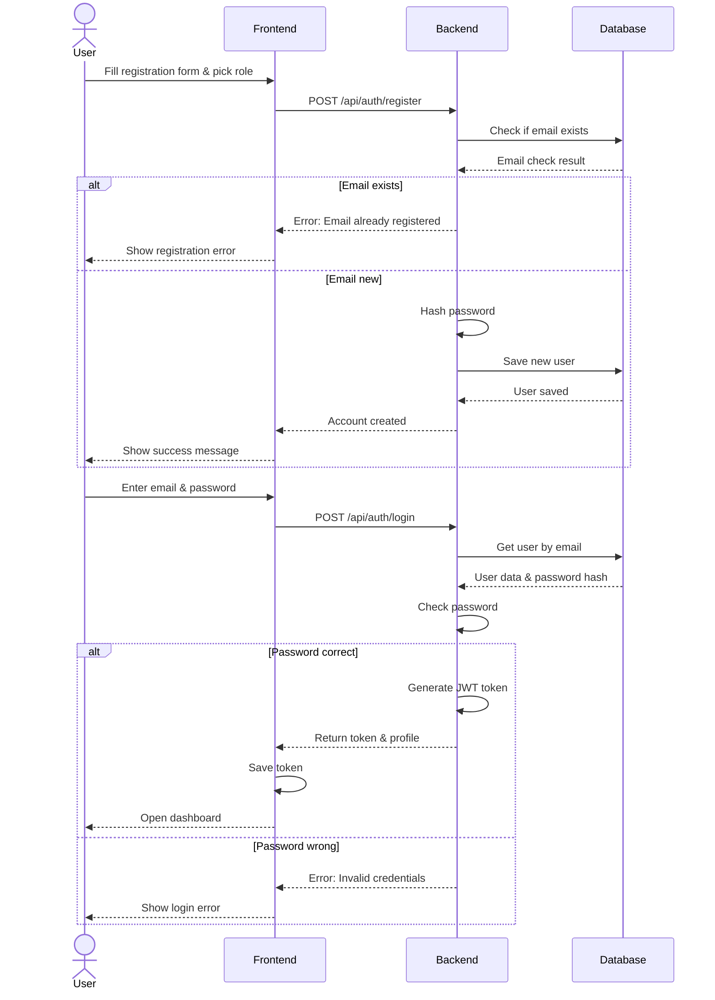
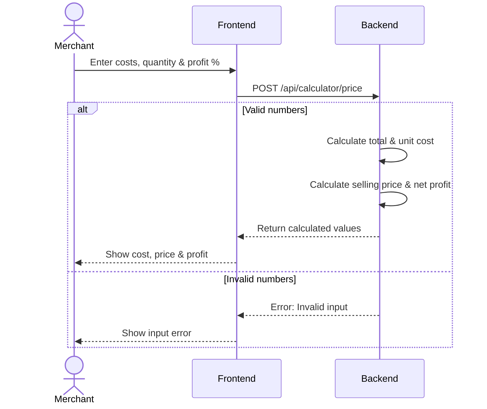

# 3. Sequence Diagrams

## Overview
This section shows sequence diagrams for 3 key use cases in the Maksab platform.

---

## 3.1 Use Case 1: User Registration and Login


---
# 3.2 Use Case 2: Checkout and Payment Flow
```mermaid
sequenceDiagram
    actor Merchant
    participant Frontend
    participant Backend
    participant Maps as Google Maps
    participant Database
    participant Moyasar

    Merchant->>Frontend: Select location on map
    Frontend->>Maps: Load map & get location
    Maps-->>Frontend: Return coordinates

    Merchant->>Frontend: Click "Checkout"
    Frontend->>Backend: POST /api/checkouts
    Backend->>Backend: Check if inside Riyadh
    Backend->>Database: Get cart items per supplier
    Database-->>Backend: Cart items
    Backend->>Database: Create checkout & orders (Status: Pending)
    Database-->>Backend: Saved
    Backend-->>Frontend: Return Checkout ID & Total

    Merchant->>Frontend: Enter card details
    Frontend->>Moyasar: Send card info for token
    Moyasar-->>Frontend: Return payment token
    Frontend->>Backend: POST /api/payments (Send token)
    Backend->>Moyasar: Process payment
    Moyasar-->>Backend: Return bank redirect link
    Backend-->>Frontend: Send redirect link
    Frontend->>Merchant: Redirect to bank verification

    Merchant->>Moyasar: Complete bank verification
    Moyasar-->>Backend: Webhook: Payment status update
    Backend->>Moyasar: Verify payment status & amount
    Moyasar-->>Backend: Confirmed

    alt Payment Success
        Backend->>Database: Update status to "Paid"
        Backend->>Database: Clear cart
        Backend-->>Moyasar: 200 OK
        Frontend-->>Merchant: Show order confirmation
    else Payment Failed
        Backend->>Database: Update status to "Failed"
        Backend-->>Moyasar: 200 OK
        Frontend-->>Merchant: Show payment failed
    end
sequenceDiagram
    actor Merchant
    participant Frontend
    participant Backend

    Merchant->>Frontend: Enter costs, quantity & profit %
    Frontend->>Backend: POST /api/calculator/price

    alt Valid numbers
        Backend->>Backend: Calculate total & unit cost
        Backend->>Backend: Calculate selling price & net profit
        Backend-->>Frontend: Return calculated values
        Frontend-->>Merchant: Show cost, price & profit
    else Invalid numbers
        Backend-->>Frontend: Error: Invalid input
        Frontend-->>Merchant: Show input error
    end

```
---
# 3.3 Use Case 3: Pricing Calculator

