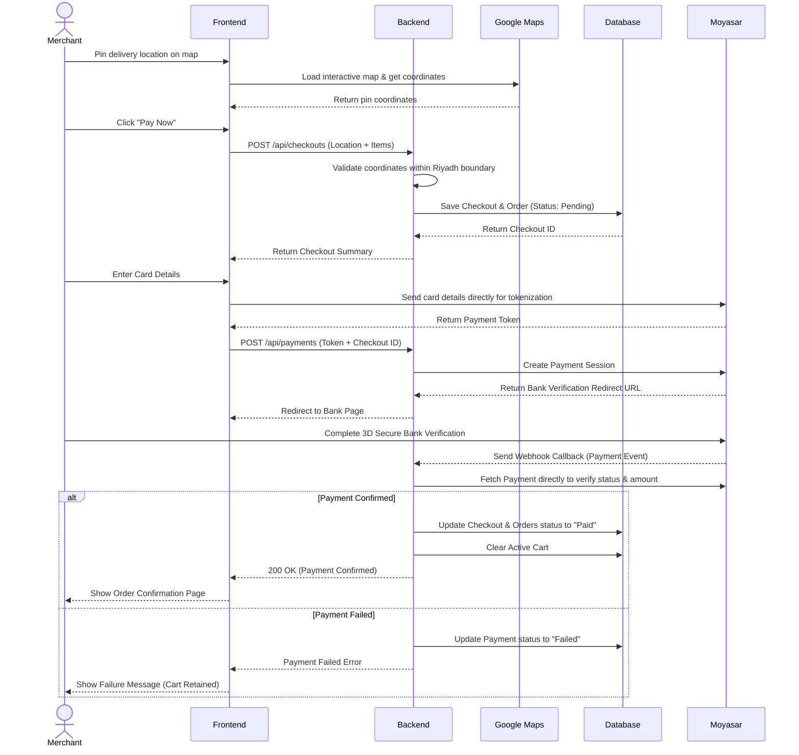
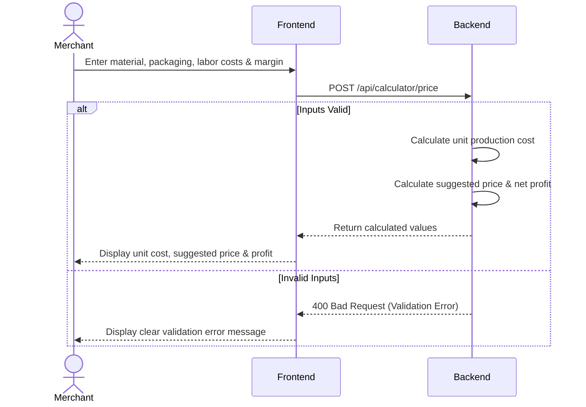

# 3. High-Level Sequence Diagrams

## Purpose

The sequence diagrams below show how the main components of Maksab (Frontend, Backend, Database, and external services) interact during key MVP use cases.

---

## 3.1 Checkout and Payment Flow

# 3.2 Pricing Calculator Flow

