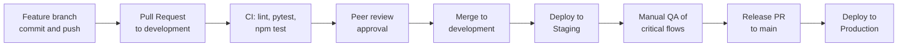

# 5. SCM and QA Strategies

## 5.1 Source Control Management (SCM)

Maksab uses **Git and GitHub**. The goal is to keep `main` always stable and demo-ready while four team members work on different features in parallel.

### Branching Strategy

A simplified GitFlow with three kinds of branches (no separate release branches, to keep the process light for a 4-person MVP).

```text
main              (Production: stable, demo-ready)
  ^
  |  Release PR
  |
development       (Staging: integration of finished features)
  ^        ^        ^        ^
  |        |        |        |   Feature PRs
feature/   feature/ feature/ feature/ ...
auth       catalog  cart-    calculator
                    checkout
```

| Branch | Purpose | Rules |
| :--- | :--- | :--- |
| `main` | Production version. Every commit is tested and demo-ready. | No direct pushes. Updated only by a Release PR from `development`. |
| `development` | Staging. Integration branch where finished features are combined and tested. | No direct pushes. Updated only by Pull Requests. |
| `feature/*` | One branch per feature or task, created from `development`. | Deleted after merging. |
| `hotfix/*` | Urgent fix for a bug found on `main`. Created from `main`, merged to both `main` and `development`. | Used only when needed. |

**Feature branch names** follow the modules of the system: `feature/auth`, `feature/catalog`, `feature/cart-checkout`, `feature/payment`, `feature/calculator`, `feature/maps-location`, `feature/supplier-orders`.

### Commit Guidelines

Commits are small and frequent: one meaningful change per commit, pushed at least once per working session. Messages follow **Conventional Commits**: `type(scope): description`.

| Type | Use for | Example |
| :--- | :--- | :--- |
| `feat` | New feature | `feat(calculator): add profit margin logic` |
| `fix` | Bug fix | `fix(cart): correct total when quantity changes` |
| `test` | Tests | `test(api): add checkout endpoint tests` |
| `docs` | Documentation | `docs: update API specification` |
| `refactor` | Code change without behavior change | `refactor(auth): extract password hashing` |
| `chore` | Config, dependencies | `chore: add flake8 configuration` |

### Pull Requests and Code Review

1. Create a feature branch from `development` and commit regularly.
2. Push the branch and open a **Pull Request** into `development`, linking the related user story (for example, "Implements US-11").
3. The **CI pipeline** must pass (lint and tests).
4. At least **one teammate other than the author** reviews and approves. Reviewers check correctness, readability, tests, and that the code matches the API and database design.
5. Merge with **Squash and merge** to keep the history clean, then delete the branch.
6. Release PRs from `development` to `main` are reviewed by the team leads (Bayadir or Reem) after the staging checks in section 5.3.

**Enforcement:** branch protection is enabled on `main` and `development` in GitHub (pull request required, 1 approval, status checks required, no direct pushes).

**Definition of Done for a PR**
- [ ] Code follows the linters (Flake8, ESLint, Prettier).
- [ ] New logic has tests, and all tests pass.
- [ ] Request and response formats match the API specification.
- [ ] Documentation is updated if the design changed.
- [ ] One teammate approved.

---

## 5.2 Quality Assurance (QA) Strategy

### Test Types and Tools

| Level | What is tested | Tool |
| :--- | :--- | :--- |
| **Unit tests (backend)** | Pricing formulas, `Cart.add_item` rules (MOQ, stock), `Product.meets_moq`, Riyadh boundary check | PyTest |
| **Integration tests (backend)** | REST endpoints against an isolated PostgreSQL test database: auth and roles, product CRUD, cart, checkout creating one order per Supplier, order status updates | PyTest with Flask test client |
| **Payment tests** | Webhook handling and server-side verification. Moyasar and Google Maps are **mocked** in automated tests so they never call real services. Real payment flows are tested manually in Moyasar **sandbox** mode. | PyTest with mocks, Moyasar sandbox |
| **Component tests (frontend)** | Calculator form and result, cart quantity changes and totals, search and filter, role-based route protection | Jest and React Testing Library (Vitest if the project uses Vite) |
| **API testing (manual and shared)** | Every endpoint in the API specification, with a shared collection the whole team uses | Postman |
| **End-to-end manual testing** | Critical user flows (below), executed on the staging environment | Manual checklist |

### Code Quality Tools

| Area | Tool |
| :--- | :--- |
| Backend style | Flake8 (PEP 8) |
| Frontend style | ESLint (Airbnb style guide) and Prettier |

### Documented Test Cases: Pricing Calculator

The Stage 2 objective requires calculator results to be verified with documented test cases. `margin` is a percentage of the selling price.

| # | Material | Packaging | Labor | Quantity | Margin | Expected result |
| :--- | :--- | :--- | :--- | :--- | :--- | :--- |
| 1 | 20 | 5 | 10 | 10 | 30 | Total 35.00, cost per unit 3.50, price 5.00, profit 1.50 |
| 2 | 100 | 20 | 30 | 50 | 25 | Total 150.00, cost per unit 3.00, price 4.00, profit 1.00 |
| 3 | 20 | 5 | 10 | 0 | 30 | Error 400 (quantity must be greater than 0) |
| 4 | 20 | 5 | 10 | 10 | 100 | Error 400 (margin must be below 100) |
| 5 | -5 | 5 | 10 | 10 | 30 | Error 400 (costs cannot be negative) |

### Critical User Flows (Manual Test Checklist)

| # | Flow | Expected result |
| :--- | :--- | :--- |
| 1 | Register as Supplier, log in, add a product | Product appears in the marketplace |
| 2 | Register as Merchant, search and filter products | Correct results; empty search shows a "no products" message |
| 3 | Add products from two Suppliers to the cart, change quantities | Cart grouped by Supplier; totals update instantly; quantity below MOQ is rejected |
| 4 | Pin a location outside Riyadh at checkout | Rejected with a clear message |
| 5 | Checkout and pay with a Moyasar sandbox card | One payment; checkout and both orders become `paid`; cart is cleared |
| 6 | Pay with a failing sandbox card | Payment fails; cart is kept; order is not marked paid |
| 7 | Log in as each Supplier | Each sees only their own paid order |
| 8 | Use the pricing calculator with valid and invalid inputs | Correct results and clear errors (see test cases above) |
| 9 | Merchant tries to open a Supplier-only endpoint | Request is rejected (`403`) |

### Continuous Integration (GitHub Actions)

A workflow in `.github/workflows/ci.yml` runs on every Pull Request:

1. **Lint:** `flake8 .` for the backend and `npm run lint` for the frontend.
2. **Backend tests:** `pytest` against a PostgreSQL test database started as a service container.
3. **Frontend tests:** `npm test`.

A Pull Request cannot be merged unless all three steps pass.

---

## 5.3 Deployment Pipeline (Staging and Production)



| Environment | Branch | Purpose | Database | Moyasar |
| :--- | :--- | :--- | :--- | :--- |
| **Local** | `feature/*` | Day-to-day development | Local PostgreSQL | Sandbox keys |
| **Staging** | `development` | Integration testing and manual QA before release | Separate staging PostgreSQL | Sandbox keys |
| **Production** | `main` | Final demo version | Separate production PostgreSQL | Sandbox keys (the MVP does not process real money) |

**Deployment setup**
- The React app is built and served by **Nginx**, which also acts as the reverse proxy for the Flask API (run with Gunicorn), as shown in the architecture.
- Each environment has its own database and its own configuration through **environment variables** (database URL, JWT secret, Moyasar keys, Google Maps key). Secrets are never committed to Git.
- Merging into `development` deploys to staging. Merging into `main` deploys to production.
- **Rollback:** if a release fails, redeploy the previous commit on `main`, or revert the Release PR.
- Hosting provider: to be confirmed by the team.
