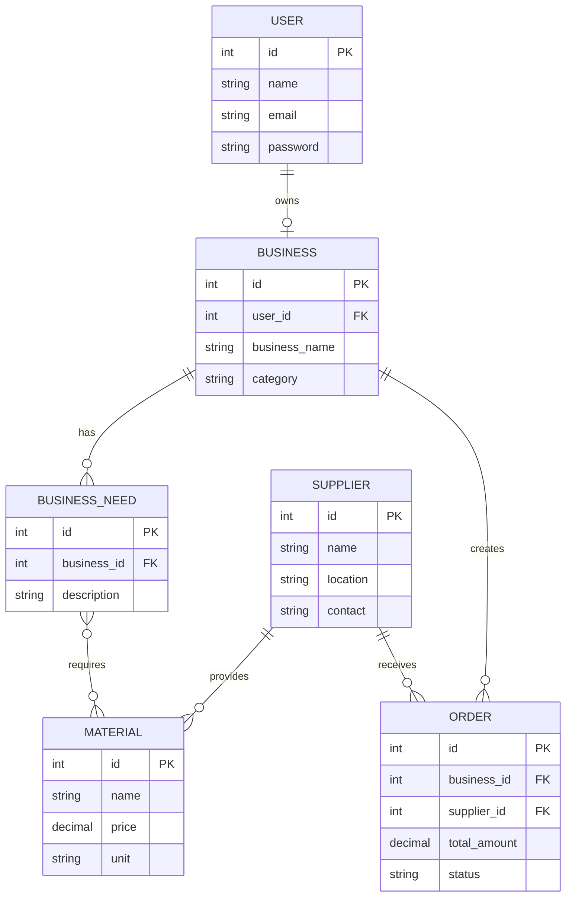

# Stage 3 Report: Technical Documentation Blueprint

**Portfolio Project – Holberton Saudi Arabia**

**Project:** Maksab (مَكْسَب) – Platform for Home-Based & Family-Production Businesses in Saudi Arabia

**Team:** Reem Alanazi, Bayadir Aldossari, Shomukh Aldosari, Shahad Alharbi

**Document Version:** 1.0


---

## 0. User Stories and Prioritization (MoSCoW)

### 👥 User Roles (Personas)
To maintain clarity across all user stories, the following terms represent the primary actors of the **Maksab (مَكْسَب)** platform:
* **Merchant:** A home-based business owner who uses Maksab to calculate product costs, manage recipes, and source wholesale supplies.
* **Supplier:** A verified vendor who lists raw materials and packaging supplies on the platform.

---

### 🎯 Prioritized User Stories

| Priority | ID | User Story |
| --- | --- | --- |
| **Must Have** | `US-01` | **As a** Merchant, **I want to** enter raw material costs, packaging costs, and labor time into a calculator, **so that** I can determine the exact production cost, suggested retail price, and profit margin. |
| **Must Have** | `US-02` | **As a** Merchant, **I want to** save my product pricing recipes to my account, **so that** I can reload, edit, or track my recipe costs over time. |
| **Must Have** | `US-03` | **As a** Merchant, **I want to** browse and filter a wholesale catalog of raw materials and packaging, **so that** I can source supplies directly from Saudi suppliers. |
| **Must Have** | `US-04` | **As a** Merchant, **I want to** add wholesale items to an interactive shopping cart and review my order summary, **so that** I can calculate my total sourcing costs before checking out. |
| **Must Have** | `US-05` | **As a** Merchant, **I want to** select my delivery location in Riyadh on an interactive map during checkout, **so that** my shipping costs are calculated based on my exact distance from the supplier. |
| **Must Have** | `US-06` | **As a** Merchant, **I want to** pay for my wholesale order online using Mada or Credit Card, **so that** my purchase is secured and confirmed immediately. |
| **Should Have** | `US-07` | **As a** Supplier, **I want to** list my raw materials and packaging products on the platform, **so that** merchants can discover and order them. |
| **Should Have** | `US-08` | **As a** Merchant, **I want to** send direct inquiry messages to suppliers regarding wholesale products, **so that** I can negotiate bulk customizations. |
| **Could Have** | `US-09` | **As a** Merchant, **I want to** sort suppliers by proximity to my selected location, **so that** I can minimize shipping time and delivery fees. |
| **Won't Have** | `US-10` | **As a** Merchant, **I want to** track my delivery driver in real time on a live GPS map, **so that** I know the exact arrival minute. |


---


## 🏛️ 1. System Architecture

Maksab follows a **Decoupled Full-Stack Web Architecture**. The frontend is built as a single-page application (SPA) using **React.js**, communicating via asynchronous JSON REST APIs with a lightweight **Python/Flask** backend. The backend enforces the **Facade Structural Pattern** to encapsulate complex business logic and streamline communication with external services (Moyasar Payment Gateway, Google Maps API, and PostgreSQL).

### 📐 High-Level System Architecture Diagram

```
+-------------------------------------------------------------------+
|                     Client Layer (Browser / SPA)                  |
|                   React.js + Axios (HTML5 / CSS3)                 |
+---------------------------------+---------------------------------+
                                  |
                                  | HTTPS / JSON REST APIs
                                  v
+---------------------------------+---------------------------------+
|                       Nginx Reverse Proxy                         |
|             (SSL Termination / Static Asset Serving)              |
+---------------------------------+---------------------------------+
                                  |
                                  v
+---------------------------------+---------------------------------+
|                       Flask Web Framework                         |
|                     (Python 3.10 REST API)                        |
|                                                                   |
|   +-----------------------------------------------------------+   |
|   |                  Facade Controller Layer                  |   |
|   |  - AuthFacade    - PricingFacade    - OrderFacade         |   |
|   +---------+--------------------+-------------------+--------+   |
+-------------|--------------------|-------------------|------------+
              |                    |                   |
              v                    v                   v
+-------------+----+     +---------+----------+   +----+----------------+
|  PostgreSQL      |     |  Moyasar/Tap API   |   | Google Maps API    |
|  Database        |     |  (Payment Gateway) |   | (Geocoding/Matrix) |
| (SQLAlchemy ORM) |     +--------------------+   +--------------------+
+------------------+

```

### 💡 Architectural Decisions & Rationale

* **React.js (Single Page Application):** Provides a smooth, highly responsive UI for complex interactive modules like the Smart Pricing Calculator, live wholesale shopping cart, and location picker without triggering full-page reloads.


* **Flask RESTful API (Python):** Chosen for its lightweight footprint and modular structure. Flask simplifies the implementation of the **Facade Structural Pattern**, allowing us to isolate external integrations behind clean, reusable API controllers.


* **PostgreSQL & SQLAlchemy ORM:** Offers structured relational storage with strong ACID compliance, ensuring relational integrity across users, wholesale orders, line items, and financial calculations.


* **Nginx Reverse Proxy:** Manages SSL termination, serves compiled frontend assets, and acts as a gateway proxy to protect Flask application processes.

---

## 🗄️ 2. Data Model (Entity-Relationship)

### 2.1 Entity-Relationship (ER) Diagram

```
+-----------------------------------+        +-----------------------------------+
|               USERS               |        |             PRODUCTS              |
+-----------------------------------+        +-----------------------------------+
| id            | UUID (PK)         |        | id            | UUID (PK)         |
| full_name     | VARCHAR(100)      |        | supplier_id   | UUID (FK -> USERS)|
| email         | VARCHAR(255) (UQ) |        | name          | VARCHAR(255)      |
| password_hash | VARCHAR(255)      |        | category      | VARCHAR(50)       |
| phone         | VARCHAR(20)       |        | unit_price    | DECIMAL(10,2)     |
| role          | VARCHAR(20)       |        | moq           | INT               |
| created_at    | TIMESTAMPTZ       |        | image_url     | VARCHAR(512)      |
+-----------------+-----------------+        +-----------------+-----------------+
                  |                                            |
                  | 1                                          | 1
                  |                                            |
                  | N                                          | N
+-----------------+-----------------+        +-----------------+-----------------+
|          PRICING_RECIPES          |        |            ORDER_ITEMS            |
+-----------------------------------+        +-----------------------------------+
| id            | UUID (PK)         |        | id            | UUID (PK)         |
| user_id       | UUID (FK -> USERS)|        | order_id      | UUID (FK -> ORDERS|
| recipe_name   | VARCHAR(150)      |        | product_id    | UUID (FK -> PROD) |
| material_cost | DECIMAL(10,2)     |        | quantity      | INT               |
| packaging_cost| DECIMAL(10,2)     |        | unit_price    | DECIMAL(10,2)     |
| labor_hours   | DECIMAL(5,2)      |        +-----------------------------------+
| hourly_rate   | DECIMAL(10,2)     |                          ^
| total_cost    | DECIMAL(10,2)     |                          | N
| suggested_price| DECIMAL(10,2)    |                          |
| profit_margin | DECIMAL(5,2)      |                          | 1
+-----------------------------------+        +------------------+----------------+
                                             |              ORDERS               |
                                             +-----------------------------------+
                                             | id            | UUID (PK)         |
                                             | user_id       | UUID (FK -> USERS)|
                                             | total_amount  | DECIMAL(10,2)     |
                                             | shipping_fee  | DECIMAL(10,2)     |
                                             | status        | VARCHAR(20)       |
                                             | delivery_addr | TEXT              |
                                             | latitude      | DECIMAL(10,8)     |
                                             | longitude     | DECIMAL(10,8)     |
                                             | payment_ref   | VARCHAR(255)      |
                                             | created_at    | TIMESTAMPTZ       |
                                             +-----------------------------------+

```

---

## 🔄 3. Sequence Diagram

### Wholesale Order, Distance Calculation & Payment Flow

```
User (Client)         React Frontend          Flask API            Google Maps API       Moyasar Payment API        Database
    |                       |                     |                       |                     |                      |
    |-- Select Location --->|                     |                       |                     |                      |
    |   on Pin Map          |-- Get Distance ---->|                       |                     |                      |
    |                       |   & Calculate Fee   |-- Calculate Matrix -->|                     |                      |
    |                       |                     |<-- Distance & Time ---|                     |                      |
    |                       |<-- Return Dist/Fee -|                       |                     |                      |
    |                       |                     |                       |                     |                      |
    |-- Click "Pay Now" ---->|                     |                       |                     |                      |
    |                       |-- POST /orders ---->|                       |                     |                      |
    |                       |   (Items + Address) |-- Insert Pending Order ----------------------------------------->|
    |                       |                     |<-- Order ID Created -----------------------------------------------|
    |                       |                     |                       |                     |                      |
    |                       |                     |-- Initialize Invoice ---------------------->|                      |
    |                       |                     |<-- Payment URL / Session -------------------|                      |
    |                       |<-- Redirect Page ---|                       |                     |                      |
    |                       |                     |                       |                     |                      |
    |-- Completes Payment ->|                     |                       |                     |                      |
    |   on Moyasar Gateway  |-- Webhook Callback -|                       |                     |                      |
    |                       |   Verification ---->|-- Verify Transaction ---------------------->|                      |
    |                       |                     |<-- Status: Paid ----------------------------|                      |
    |                       |                     |                                                                    |
    |                       |                     |-- Update Order Status to "Paid" ---------------------------------->|
    |                       |<-- 200 OK (Invoice)-|                                                                    |
    |<-- Order Confirmed ---|                     |                                                                    |

```

---

## 🔌 4. API Specifications

### 4.1 External Third-Party Integrations

1. **Moyasar / Tap Payment API:**

* **Purpose:** Direct online payment gateway processing using Mada, Visa, and Mastercard for wholesale orders.


* **Endpoint:** `POST [https://api.moyasar.com/v1/payments](https://api.moyasar.com/v1/payments)`
* **Authentication:** HTTP Basic Auth using API Secret Key.


2. **Google Maps Distance Matrix & Geocoding API:**

* **Purpose:** Translates map pin locations into structured Riyadh addresses and calculates driving distance to determine dynamic shipping fees.


* **Endpoint:** `GET [https://maps.googleapis.com/maps/api/distancematrix/json](https://maps.googleapis.com/maps/api/distancematrix/json)`


---

### 4.2 Internal API Endpoints

#### 1. Smart Pricing Calculator

* **HTTP Method:** `POST`
* **Endpoint:** `/api/v1/calculator/calculate`
* **Request Headers:** `Content-Type: application/json`
* **Request Body:**

```json
{
  "materialCost": 45.00,
  "packagingCost": 10.00,
  "laborHours": 2.5,
  "hourlyRate": 20.00,
  "desiredMarginPercentage": 35.0
}

```

* **Success Response (`200 OK`):**

```json
{
  "status": "success",
  "data": {
    "totalProductionCost": 105.00,
    "suggestedRetailPrice": 161.54,
    "netProfit": 56.54,
    "marginPercentage": 35.0
  }
}

```

#### 2. Create Wholesale Order

* **HTTP Method:** `POST`
* **Endpoint:** `/api/v1/orders`
* **Request Headers:**
* `Content-Type: application/json`
* `Authorization: Bearer <JWT_TOKEN>`


* **Request Body:**

```json
{
  "items": [
    {
      "productId": "d3b07384-d113-42e2-9b2d-9b57683939a2",
      "quantity": 10
    }
  ],
  "shippingAddress": {
    "street": "King Fahd Road",
    "city": "Riyadh",
    "latitude": 24.7136,
    "longitude": 46.6753
  }
}

```

* **Success Response (`201 Created`):**

```json
{
  "status": "success",
  "data": {
    "orderId": "e4c56789-e12b-34cd-56ef-789012345678",
    "subtotal": 500.00,
    "shippingFee": 35.00,
    "totalAmount": 535.00,
    "status": "pending_payment",
    "paymentUrl": "https://api.moyasar.com/v1/invoice/sample_token"
  }
}

```

---

## 🛠️ 5. SCM and QA Strategies

### 5.1 Source Control Management (SCM)

```
         +----------------------------------------------------------+
         |                    main (Production)                     |
         +----------------------------------------------------------+
                                      ^
                                      | Production Release PR
                                      |
         +----------------------------------------------------------+
         |                 development (Staging)                    |
         +----------------------------------------------------------+
                  ^                                ^
                  | Feature PR                     | Feature PR
                  |                                |
  +---------------+---------------+  +-------------+----------------+
  |  feature/pricing-calculator   |  |   feature/wholesale-cart     |
  +-------------------------------+  +------------------------------+

```

* **Branching Model:** Modified GitFlow featuring `main`, `development`, and task-specific `feature/*` branches.
* **Commit Guidelines:** Follows Conventional Commits (e.g., `feat(calculator): add profit margin logic`, `fix(api): handle missing shipping coordinate edge cases`).
* **Pull Request (PR) Policy:**
* Direct pushes to `main` and `development` are restricted.


* Requires **at least 1 peer review approval** from team leads (Bayadir / Reem).


* Automated CI pipeline must pass before merging.


### 5.2 Quality Assurance (QA) Strategy

* **Frontend Unit & Component Testing:** Jest and React Testing Library to test pricing calculator rendering, state updates, and cart item modifications.
* **Backend Integration Testing:** PyTest executed against an isolated PostgreSQL test database to verify REST API responses and calculation accuracy.
* **Code Style Enforcers:**
* **Backend:** Flake8 (PEP 8 compliance).
* **Frontend:** ESLint (Airbnb JavaScript Style Guide) + Prettier.


* **Continuous Integration (CI):** GitHub Actions executing on every Pull Request:
1. `npm run lint` & `flake8 .` (Static Code Analysis)
2. `pytest` (Backend Unit & Integration Tests)
3. `npm test` (React Component Tests)


---

## ⚖️ 6. Technical Rationales & Justifications

* **React + Flask Decoupled Architecture:** Provides clear technical separation between backend data processing (Shahad) and frontend UI management (Shomukh), enabling concurrent feature development without code collisions.


* **PostgreSQL over NoSQL:** Financial accounting for production pricing and multi-item wholesale orders demands strong ACID guarantees and relational constraints, making PostgreSQL the safest choice.


* **Facade Structural Pattern:** Abstracts third-party complexities (Moyasar payment webhooks, Google Maps distance matrix calculations) behind clean internal Flask controllers, keeping the codebase maintainable and testable.
