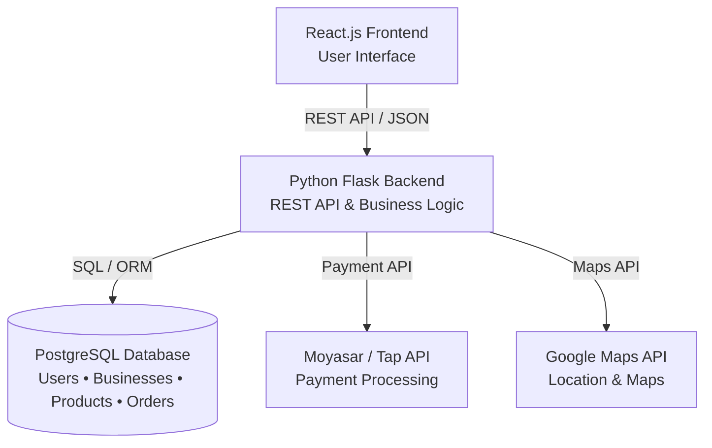
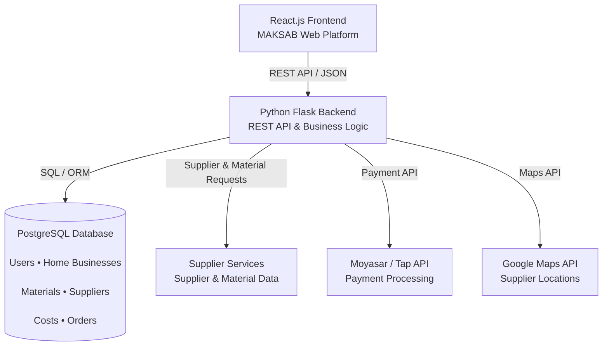
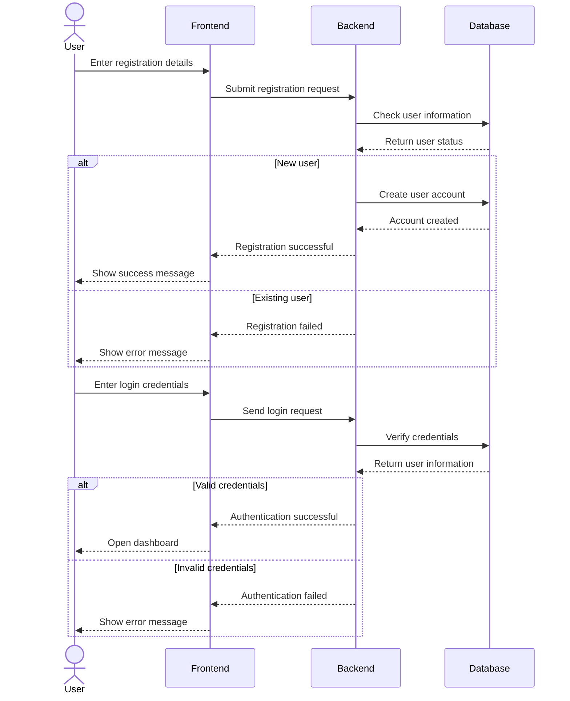
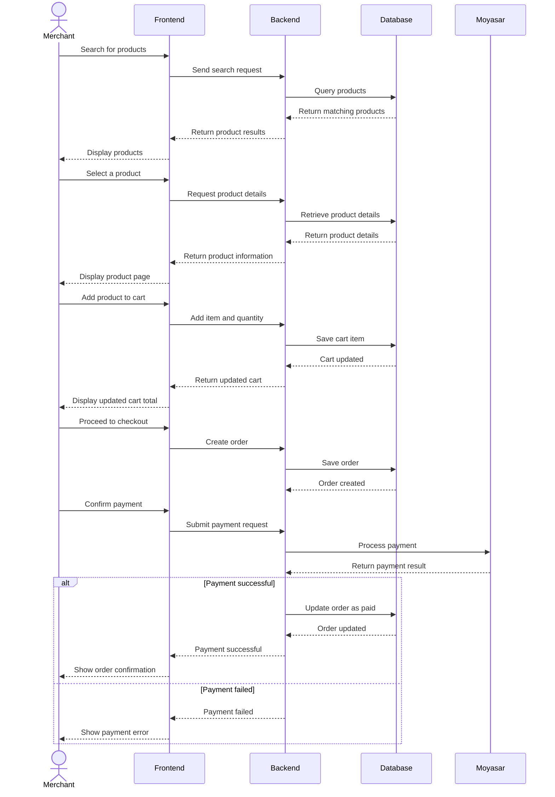
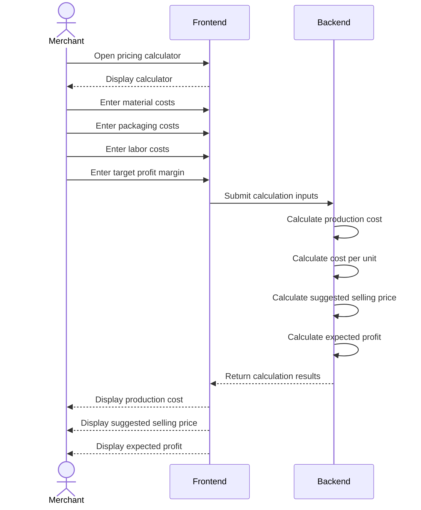

# Task 0: User Stories & Scope Definition (MoSCoW Matrix)

## 🎯 Project Overview
**Maksab (مَكْسَب)** is a B2B wholesale marketplace and smart pricing calculator platform tailored for home-based businesses (Merchants) and wholesale suppliers in Riyadh, Saudi Arabia.

---

## 👤 Target Roles
- **Merchant (الأسرة المنتجة):** Home-based business owner sourcing wholesale raw materials and packaging.
- **Supplier (المورد):** Wholesale distributor listing supplies and fulfilling bulk orders.
> **Note:** Admin dashboard is explicitly out of scope for the MVP and managed directly via backend/database administration by the developers.

---

## 📜 User Stories (16 Granular Stories)

### 🔐 1. Authentication & Profile Management
- **US-01:** As a new user, I want to register and select my role (Merchant or Supplier), so that I can access features tailored to my business model.
- **US-02:** As a registered user, I want to securely log in with my credentials, so that I can access my active cart, order history, and account settings.
- **US-03:** As a user, I want to manage my business profile details (business name, contact info, delivery address), so that other parties can identify and contact my business accurately.

### 📦 2. Supplier Catalog & Order Management
- **US-04:** As a Supplier, I want to list new wholesale products with photos, bulk pricing, descriptions, and Minimum Order Quantity (MOQ), so that Merchants can discover and purchase them.
- **US-05:** As a Supplier, I want to update product pricing and stock availability (In Stock / Out of Stock), so that Merchants only order available items.
- **US-06:** As a Supplier, I want to view incoming orders and update their status (Processing / Shipped / Delivered), so that I can manage order fulfillment effectively.

### 🛒 3. Merchant Marketplace & Shopping
- **US-07:** As a Merchant, I want to search for wholesale products by item name or supplier name, so that I can find required supplies quickly.
- **US-08:** As a Merchant, I want to filter products by category (raw materials, packaging) and price range, so that I can browse items that match my budget.
- **US-09:** As a Merchant, I want to view detailed product pages including supplier specifications and minimum order requirements, so that I can make informed buying decisions.
- **US-10:** As a Merchant, I want to add/remove items and modify quantities in an interactive shopping cart with dynamic total calculation, so that I can review my order expenses before checkout.

### 🧮 4. Standalone Pricing Calculator
- **US-11:** As a Merchant, I want to manually input raw material, packaging, and labor/time costs into a standalone calculator, so that the system computes the exact production cost per unit.
- **US-12:** As a Merchant, I want to set a target profit margin percentage, so that the calculator suggests optimal retail pricing and expected net profit per unit.

### 💳 5. Location Services, Checkout & Payment
- **US-13:** As a Merchant, I want to pinpoint my precise business location in Riyadh using an interactive Google Map, so that suppliers deliver orders to the correct address.
- **US-14:** As a Merchant, I want to pay for wholesale orders securely online using payment gateways (Moyasar), so that transactions are instantly completed without cash handling.
- **US-15:** As a Merchant, I want to view past order history and download digital payment receipts, so that I can track my business expenses and financial records.

### 💬 6. Communication & Inquiries
- **US-16:** As a Merchant, I want to send and receive direct messages with Suppliers within the app, so that I can inquire about product availability and bulk custom orders before buying.

---

## 📊 MoSCoW Prioritization Matrix

| Category | User Stories | Technical Justification & Scope Rationale |
| :--- | :--- | :--- |
| **Must Have** | US-01, US-02, US-04, US-07, US-09, US-10, US-11, US-13, US-14 | **Core MVP Engine:** Essential features required for user registration, supplier catalog, marketplace browsing, shopping cart, standalone calculator, Google Maps location pinning, and online payment integration. |
| **Should Have** | US-03, US-05, US-06, US-08, US-12, US-15 | **Core Operational Enhancements:** Business profile management, inventory status updates, order status management, advanced filtering, retail price suggestion, and order receipt history. |
| **Could Have** | US-16 | **Desirable Feature:** In-app direct messaging between Merchant and Supplier for custom inquiries. |
| **Won't Have** | Admin Dashboard, Saved Recipe Database, Live Driver GPS Tracking | **Explicitly Out of MVP Scope:** Excluded to focus development efforts on B2B core flow, reduce complexity, and meet project deadlines. |

# Task 1:  Design System Architecture
*React.js frontend communicates with the Python Flask backend through REST APIs (using JSON format). The backend handles the core business logic, including the pricing calculator engine and order processing, while communicating with PostgreSQL via SQL/ORM for data management (Users, Businesses, Supplies, Costs, and Orders). Additionally, the system seamlessly integrates with external services, including Moyasar/Tap API for payment processing, Google Maps API for location-based logistics, and Supplier Services for raw material requests.*

##  System Architecture

##  MAKSAB System Architecture

###  Architectural Decisions & Rationale

* **React.js (Single Page Application):** Provides a smooth, highly responsive UI for complex interactive modules like the Smart Pricing Calculator, live wholesale shopping cart, and location picker without triggering full-page reloads.

* **Flask RESTful API (Python):** Chosen for its lightweight footprint and modular structure. Flask simplifies the implementation of the **Facade Structural Pattern**, allowing us to isolate external integrations behind clean, reusable API controllers.

* **PostgreSQL & SQLAlchemy ORM:** Offers structured relational storage with strong ACID compliance, ensuring relational integrity across users, wholesale orders, line items, and financial calculations.

* **Nginx Reverse Proxy:** Manages SSL termination, serves compiled frontend assets, and acts as a gateway proxy to protect Flask application processes.

---
## 3. High-Level Sequence Diagrams

### Purpose

The sequence diagrams below show how the main components of Maksab interact during key MVP use cases.

---

### 3.1 User Registration and Login

---

### 3.2 Product Browsing, Cart, Checkout and Payment

---

### 3.3 Production Cost and Pricing Calculator

---

### 3.4 Main Components

| Component           | Responsibility                                                             |
| ------------------- | -------------------------------------------------------------------------- |
| Merchant / Supplier | Interacts with the Maksab platform                                         |
| Frontend            | Provides the user interface and sends requests to the backend              |
| Backend             | Handles business logic, authentication, products, orders, and calculations |
| Database            | Stores users, products, carts, orders, and related data                    |
| Moyasar             | Processes online payments                                                  |
| Google Maps         | Provides location services for delivery addresses                          |

These diagrams provide a high-level view of the main interactions within the Maksab MVP.

