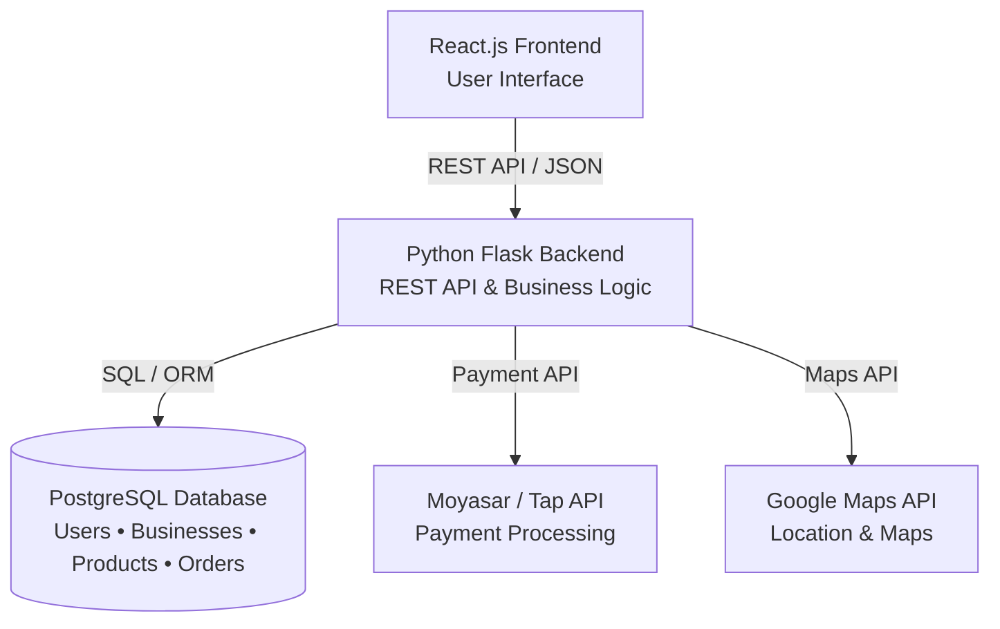
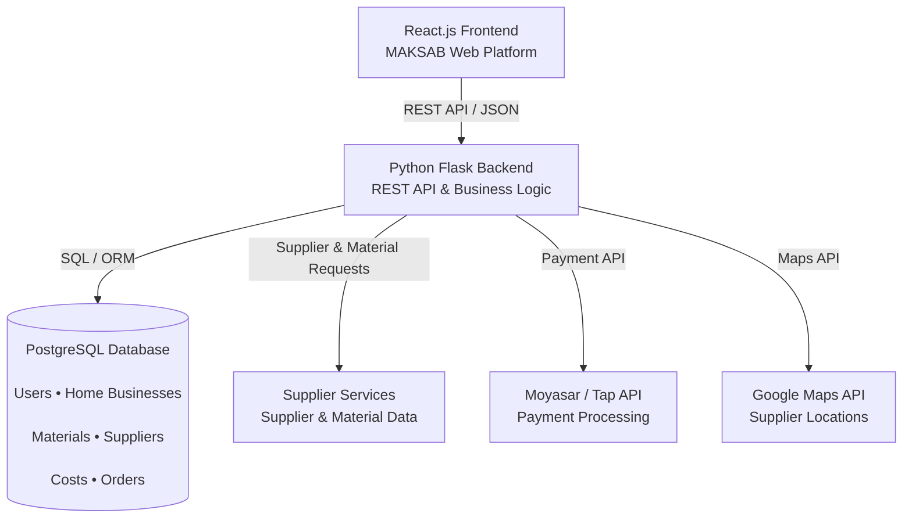
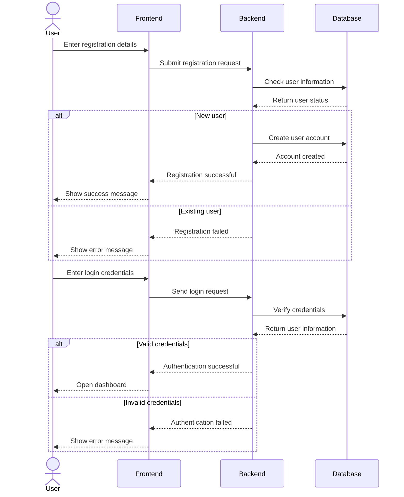
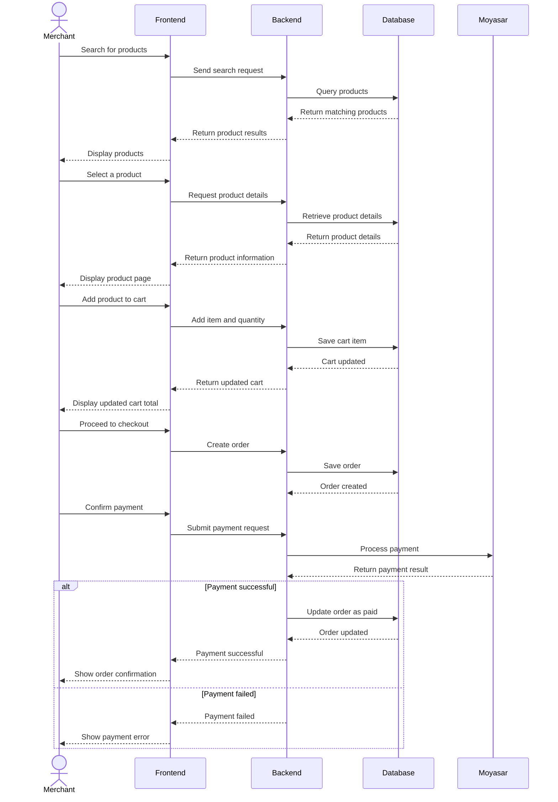
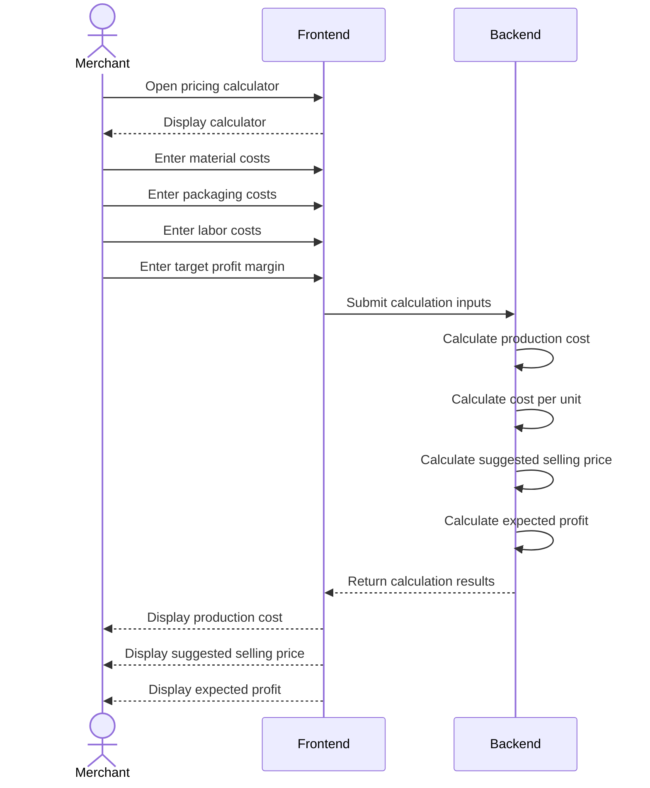

# Task 0: User Stories & Scope Definition (MoSCoW Matrix)

## 🎯 Project Overview
**Maksab (مَكْسَب)** is a B2B wholesale marketplace and smart pricing calculator platform tailored for home-based businesses (Merchants) and wholesale suppliers in Riyadh, Saudi Arabia.

---

## 👤 Target Roles
- **Merchant (الأسرة المنتجة):** Home-based business owner sourcing wholesale raw materials and packaging.
- **Supplier (المورد):** Wholesale distributor listing supplies and fulfilling bulk orders.
> **Note:** Admin dashboard is explicitly out of scope for the MVP and managed directly via backend/database administration by the developers.

---

## 📜 User Stories (16 Granular Stories)

### 🔐 1. Authentication & Profile Management
- **US-01:** As a new user, I want to register and select my role (Merchant or Supplier), so that I can access features tailored to my business model.
- **US-02:** As a registered user, I want to securely log in with my credentials, so that I can access my active cart, order history, and account settings.
- **US-03:** As a user, I want to manage my business profile details (business name, contact info, delivery address), so that other parties can identify and contact my business accurately.

### 📦 2. Supplier Catalog & Order Management
- **US-04:** As a Supplier, I want to list new wholesale products with photos, bulk pricing, descriptions, and Minimum Order Quantity (MOQ), so that Merchants can discover and purchase them.
- **US-05:** As a Supplier, I want to update product pricing and stock availability (In Stock / Out of Stock), so that Merchants only order available items.
- **US-06:** As a Supplier, I want to view incoming orders and update their status (Processing / Shipped / Delivered), so that I can manage order fulfillment effectively.

### 🛒 3. Merchant Marketplace & Shopping
- **US-07:** As a Merchant, I want to search for wholesale products by item name or supplier name, so that I can find required supplies quickly.
- **US-08:** As a Merchant, I want to filter products by category (raw materials, packaging) and price range, so that I can browse items that match my budget.
- **US-09:** As a Merchant, I want to view detailed product pages including supplier specifications and minimum order requirements, so that I can make informed buying decisions.
- **US-10:** As a Merchant, I want to add/remove items and modify quantities in an interactive shopping cart with dynamic total calculation, so that I can review my order expenses before checkout.

### 🧮 4. Standalone Pricing Calculator
- **US-11:** As a Merchant, I want to manually input raw material, packaging, and labor/time costs into a standalone calculator, so that the system computes the exact production cost per unit.
- **US-12:** As a Merchant, I want to set a target profit margin percentage, so that the calculator suggests optimal retail pricing and expected net profit per unit.

### 💳 5. Location Services, Checkout & Payment
- **US-13:** As a Merchant, I want to pinpoint my precise business location in Riyadh using an interactive Google Map, so that suppliers deliver orders to the correct address.
- **US-14:** As a Merchant, I want to pay for wholesale orders securely online using payment gateways (Moyasar), so that transactions are instantly completed without cash handling.
- **US-15:** As a Merchant, I want to view past order history and download digital payment receipts, so that I can track my business expenses and financial records.

### 💬 6. Communication & Inquiries
- **US-16:** As a Merchant, I want to send and receive direct messages with Suppliers within the app, so that I can inquire about product availability and bulk custom orders before buying.

---

## 📊 MoSCoW Prioritization Matrix

| Category | User Stories | Technical Justification & Scope Rationale |
| :--- | :--- | :--- |
| **Must Have** | US-01, US-02, US-04, US-07, US-09, US-10, US-11, US-13, US-14 | **Core MVP Engine:** Essential features required for user registration, supplier catalog, marketplace browsing, shopping cart, standalone calculator, Google Maps location pinning, and online payment integration. |
| **Should Have** | US-03, US-05, US-06, US-08, US-12, US-15 | **Core Operational Enhancements:** Business profile management, inventory status updates, order status management, advanced filtering, retail price suggestion, and order receipt history. |
| **Could Have** | US-16 | **Desirable Feature:** In-app direct messaging between Merchant and Supplier for custom inquiries. |
| **Won't Have** | Admin Dashboard, Saved Recipe Database, Live Driver GPS Tracking | **Explicitly Out of MVP Scope:** Excluded to focus development efforts on B2B core flow, reduce complexity, and meet project deadlines. |

# Task 1:  Design System Architecture
*React.js frontend communicates with the Python Flask backend through REST APIs (using JSON format). The backend handles the core business logic, including the pricing calculator engine and order processing, while communicating with PostgreSQL via SQL/ORM for data management (Users, Businesses, Supplies, Costs, and Orders). Additionally, the system seamlessly integrates with external services, including Moyasar/Tap API for payment processing, Google Maps API for location-based logistics, and Supplier Services for raw material requests.*

##  System Architecture

##  MAKSAB System Architecture


###  Architectural Decisions & Rationale

* **React.js (Single Page Application):** Provides a smooth, highly responsive UI for complex interactive modules like the Smart Pricing Calculator, live wholesale shopping cart, and location picker without triggering full-page reloads.


* **Flask RESTful API (Python):** Chosen for its lightweight footprint and modular structure. Flask simplifies the implementation of the **Facade Structural Pattern**, allowing us to isolate external integrations behind clean, reusable API controllers.


* **PostgreSQL & SQLAlchemy ORM:** Offers structured relational storage with strong ACID compliance, ensuring relational integrity across users, wholesale orders, line items, and financial calculations.


* **Nginx Reverse Proxy:** Manages SSL termination, serves compiled frontend assets, and acts as a gateway proxy to protect Flask application processes.

---
## 3. High-Level Sequence Diagrams

### Purpose

The sequence diagrams below show how the main components of Maksab interact during key MVP use cases.

---

### 3.1 User Registration and Login



---

### 3.2 Product Browsing, Cart, Checkout and Payment



---

### 3.3 Production Cost and Pricing Calculator



---

### 3.4 Main Components

| Component           | Responsibility                                                             |
| ------------------- | -------------------------------------------------------------------------- |
| Merchant / Supplier | Interacts with the Maksab platform                                         |
| Frontend            | Provides the user interface and sends requests to the backend              |
| Backend             | Handles business logic, authentication, products, orders, and calculations |
| Database            | Stores users, products, carts, orders, and related data                    |
| Moyasar             | Processes online payments                                                  |
| Google Maps         | Provides location services for delivery addresses                          |

These diagrams provide a high-level view of the main interactions within the Maksab MVP.

## 4. External and Internal APIs

### 4.1 External APIs

Maksab will use external APIs to support location services and online payment processing.

| External API        | Purpose                                                                      | Why It Was Chosen                                                                                                          |
| ------------------- | ---------------------------------------------------------------------------- | -------------------------------------------------------------------------------------------------------------------------- |
| **Google Maps API** | Allows Merchants to select and pinpoint their business or delivery location. | It provides reliable map and location services and supports interactive location selection.                                |
| **Moyasar API**     | Processes online payments for wholesale orders.                              | Moyasar supports online payments in Saudi Arabia and provides payment processing suitable for the project's target market. |

---

### 4.2 Internal REST API

The Maksab backend will provide a RESTful API that connects the frontend with the database and handles authentication, products, carts, orders, and pricing calculations.

The API will use **JSON** for request and response data.

**Base URL:**

```text
/api
```

---

### 4.3 Authentication Endpoints

| Endpoint             | Method | Input | Output                                     |
| -------------------- | ------ | ----- | ------------------------------------------ |
| `/api/auth/register` | POST   | JSON  | User account information                   |
| `/api/auth/login`    | POST   | JSON  | Authentication result and user information |

#### Register User

```http
POST /api/auth/register
Content-Type: application/json
```

Request:

```json
{
  "name": "Ahmed Ali",
  "email": "ahmed@example.com",
  "password": "********",
  "role": "merchant"
}
```

Response:

```json
{
  "message": "User registered successfully",
  "user": {
    "id": 1,
    "name": "Ahmed Ali",
    "email": "ahmed@example.com",
    "role": "merchant"
  }
}
```

#### Login

```http
POST /api/auth/login
Content-Type: application/json
```

Request:

```json
{
  "email": "ahmed@example.com",
  "password": "********"
}
```

Response:

```json
{
  "message": "Login successful",
  "user": {
    "id": 1,
    "name": "Ahmed Ali",
    "role": "merchant"
  }
}
```

---

### 4.4 Product Endpoints

| Endpoint             | Method | Input            | Output           |
| -------------------- | ------ | ---------------- | ---------------- |
| `/api/products`      | GET    | Query parameters | List of products |
| `/api/products/{id}` | GET    | Product ID       | Product details  |
| `/api/products`      | POST   | JSON             | Created product  |
| `/api/products/{id}` | PUT    | JSON             | Updated product  |

#### Search Products

```http
GET /api/products?search=packaging&category=packaging
```

Response:

```json
{
  "products": [
    {
      "id": 12,
      "name": "Paper Food Boxes",
      "category": "packaging",
      "price": 45.00,
      "moq": 100,
      "stock_status": "in_stock",
      "supplier_id": 5
    }
  ]
}
```

#### Get Product Details

```http
GET /api/products/12
```

Response:

```json
{
  "id": 12,
  "name": "Paper Food Boxes",
  "description": "Food-safe paper boxes",
  "price": 45.00,
  "moq": 100,
  "stock_status": "in_stock",
  "supplier_id": 5
}
```

---

### 4.5 Cart Endpoints

| Endpoint               | Method | Input          | Output           |
| ---------------------- | ------ | -------------- | ---------------- |
| `/api/cart`            | GET    | Authentication | Current cart     |
| `/api/cart/items`      | POST   | JSON           | Added cart item  |
| `/api/cart/items/{id}` | PUT    | JSON           | Updated quantity |
| `/api/cart/items/{id}` | DELETE | Cart item ID   | Updated cart     |

#### Add Item to Cart

```http
POST /api/cart/items
Content-Type: application/json
```

Request:

```json
{
  "product_id": 12,
  "quantity": 200
}
```

Response:

```json
{
  "message": "Item added to cart",
  "cart": {
    "items": [
      {
        "product_id": 12,
        "quantity": 200,
        "unit_price": 45.00,
        "subtotal": 90.00
      }
    ],
    "total": 90.00
  }
}
```

---

### 4.6 Order and Checkout Endpoints

| Endpoint                   | Method | Input          | Output         |
| -------------------------- | ------ | -------------- | -------------- |
| `/api/orders`              | POST   | JSON           | Created order  |
| `/api/orders`              | GET    | Authentication | Order history  |
| `/api/orders/{id}`         | GET    | Order ID       | Order details  |
| `/api/orders/{id}/payment` | POST   | JSON           | Payment result |

#### Create Order

```http
POST /api/orders
Content-Type: application/json
```

Request:

```json
{
  "delivery_address": "Riyadh, Saudi Arabia",
  "latitude": 24.7136,
  "longitude": 46.6753
}
```

Response:

```json
{
  "message": "Order created successfully",
  "order": {
    "id": 101,
    "status": "pending_payment",
    "total": 90.00
  }
}
```

#### Process Payment

```http
POST /api/orders/101/payment
Content-Type: application/json
```

Request:

```json
{
  "payment_method": "card"
}
```

Response:

```json
{
  "message": "Payment successful",
  "order_id": 101,
  "payment_status": "paid"
}
```

The backend will communicate with the **Moyasar API** to process the actual payment. Payment credentials and sensitive payment information will not be stored directly in the Maksab database.

---

### 4.7 Pricing Calculator Endpoint

The pricing calculator is a core feature of Maksab and allows Merchants to calculate production costs and suggested selling prices.

| Endpoint                | Method | Input | Output                                              |
| ----------------------- | ------ | ----- | --------------------------------------------------- |
| `/api/calculator/price` | POST   | JSON  | Production cost, selling price, and expected profit |

#### Calculate Product Price

```http
POST /api/calculator/price
Content-Type: application/json
```

Request:

```json
{
  "material_cost": 20.00,
  "packaging_cost": 5.00,
  "labor_cost": 10.00,
  "quantity": 10,
  "profit_margin": 30
}
```

Response:

```json
{
  "total_production_cost": 35.00,
  "cost_per_unit": 3.50,
  "suggested_price_per_unit": 5.00,
  "expected_profit_per_unit": 1.50
}
```

---

### 4.8 Profile and Location Endpoints

| Endpoint                | Method | Input          | Output           |
| ----------------------- | ------ | -------------- | ---------------- |
| `/api/profile`          | GET    | Authentication | User profile     |
| `/api/profile`          | PUT    | JSON           | Updated profile  |
| `/api/profile/location` | PUT    | JSON           | Updated location |

#### Update Business Location

```http
PUT /api/profile/location
Content-Type: application/json
```

Request:

```json
{
  "latitude": 24.7136,
  "longitude": 46.6753,
  "address": "Riyadh, Saudi Arabia"
}
```

Response:

```json
{
  "message": "Location updated successfully",
  "location": {
    "latitude": 24.7136,
    "longitude": 46.6753,
    "address": "Riyadh, Saudi Arabia"
  }
}
```

The frontend will use **Google Maps** to allow the Merchant to select the location interactively. The selected coordinates will then be sent to the Maksab backend.

---

### 4.9 API Design Principles

The Maksab API will follow common REST API practices:

* Use HTTP methods according to the operation being performed.
* Use clear and resource-based endpoint names.
* Use JSON for API requests and responses.
* Use HTTP status codes to indicate the result of requests.
* Validate user input on the backend.
* Protect authenticated endpoints from unauthorized access.
* Avoid storing sensitive payment information in the application database.
* Keep external API credentials on the backend and never expose them directly to the frontend.

### 4.10 API Summary

The internal API provides the main connection between the Maksab frontend and backend. It supports the core MVP functionality including:

**Authentication → Products → Cart → Orders → Payment → Pricing Calculator → Profile & Location**

External services such as **Google Maps** and **Moyasar** are integrated through the backend where appropriate.

# 5. SCM and QA Strategies

## 5.1 Software Configuration Management (SCM)

Maksab will use **Git and GitHub** to manage source code, track changes, and coordinate development between team members.

### Repository Structure

The project repository will contain the main application code, documentation, database configuration, tests, and project-related files.

```text
maksab/
├── backend/
├── frontend/
├── tests/
├── database/
├── docs/
├── README.md
└── .gitignore
```

### Branching Strategy

The team will use a simple Git branching strategy to keep the main codebase stable while allowing team members to work on different features.

```text
main
  │
  └── development
       ├── feature/authentication
       ├── feature/products
       ├── feature/cart
       ├── feature/orders
       ├── feature/calculator
       └── feature/profile-location
```

#### Branches

| Branch        | Purpose                                                                   |
| ------------- | ------------------------------------------------------------------------- |
| `main`        | Stable version of the project that is ready for release or demonstration. |
| `development` | Integration branch where completed features are combined and tested.      |
| `feature/*`   | Used by developers to implement individual features or tasks.             |

### Commit Strategy

Team members will make regular commits after completing a small, meaningful change rather than combining many unrelated changes into one commit.

Commit messages should clearly describe the change.

Examples:

```text
feat: add user registration endpoint
feat: implement product search
fix: correct cart total calculation
test: add calculator API tests
docs: update API documentation
```

### Pull Requests and Code Reviews

Before a feature is merged into the `development` branch:

1. The developer pushes the feature branch to GitHub.
2. A Pull Request is created.
3. Another team member reviews the code.
4. The reviewer checks functionality, readability, and potential errors.
5. Required changes are completed if issues are found.
6. The Pull Request is merged into `development`.
7. The feature branch can then be deleted after merging.

Direct pushes to `main` should be avoided.

---

## 5.2 QA Strategy

Quality assurance will be performed throughout development rather than only at the end of the project.

The testing strategy will focus on the main Maksab MVP functionality:

* Authentication
* Product management
* Product search and filtering
* Shopping cart
* Order creation
* Payment integration
* Pricing calculator
* Business profile and location

### Testing Levels

| Test Type               | Purpose                                                                               | Example                                                                       |
| ----------------------- | ------------------------------------------------------------------------------------- | ----------------------------------------------------------------------------- |
| **Unit Testing**        | Test individual functions or components independently.                                | Test pricing and profit calculations.                                         |
| **API Testing**         | Verify that backend endpoints return the expected results.                            | Test login, products, cart, and order endpoints.                              |
| **Integration Testing** | Verify that multiple system components work together correctly.                       | Test creating an order and saving it in the database.                         |
| **End-to-End Testing**  | Test complete user workflows from the user's perspective.                             | Merchant searches for a product, adds it to the cart, and completes checkout. |
| **Manual Testing**      | Check UI behavior and important scenarios that may not be covered by automated tests. | Test forms, navigation, validation messages, and responsive behavior.         |

---

## 5.3 Testing Tools

The team will use the following tools during development:

| Tool                        | Usage                                           |
| --------------------------- | ----------------------------------------------- |
| **Postman**                 | Test and validate REST API endpoints.           |
| **Pytest**                  | Unit and backend testing for Python code.       |
| **GitHub**                  | Source control, Pull Requests, and code review. |
| **Browser Developer Tools** | Debug frontend behavior and API requests.       |

---

## 5.4 API Testing

Postman will be used to test the Maksab REST API.

The main endpoints to test include:

```text
POST   /api/auth/register
POST   /api/auth/login

GET    /api/products
GET    /api/products/{id}
POST   /api/products
PUT    /api/products/{id}

GET    /api/cart
POST   /api/cart/items
PUT    /api/cart/items/{id}
DELETE /api/cart/items/{id}

POST   /api/orders
GET    /api/orders
GET    /api/orders/{id}
POST   /api/orders/{id}/payment

POST   /api/calculator/price

GET    /api/profile
PUT    /api/profile
PUT    /api/profile/location
```

For each endpoint, the team will check:

* Correct HTTP method.
* Valid request data.
* Invalid or missing input.
* Authentication and authorization.
* Correct HTTP status code.
* Correct JSON response.
* Database changes when applicable.
* Error handling.

---

## 5.5 End-to-End Testing

End-to-end testing will focus on the most important Merchant workflow.

### Main Purchase Flow

```text
Register / Login
      ↓
Search for Product
      ↓
View Product Details
      ↓
Add Product to Cart
      ↓
Review Cart
      ↓
Enter Delivery Location
      ↓
Create Order
      ↓
Complete Payment
      ↓
Receive Order Confirmation
```

The team will verify that data is correctly passed between the frontend, backend, database, and payment service throughout the complete flow.

### Pricing Calculator Flow

```text
Open Calculator
      ↓
Enter Material Cost
      ↓
Enter Packaging Cost
      ↓
Enter Labor Cost
      ↓
Enter Profit Margin
      ↓
Calculate
      ↓
Display Cost Per Unit
      ↓
Display Suggested Selling Price
      ↓
Display Expected Profit
```

---

## 5.6 QA Workflow

Testing will be integrated into the development process.

```text
Develop Feature
      ↓
Run Unit Tests
      ↓
Test API with Postman
      ↓
Create Pull Request
      ↓
Code Review
      ↓
Fix Issues
      ↓
Merge into Development
      ↓
Integration Testing
      ↓
End-to-End Testing
      ↓
Release Candidate
```

---

## 5.7 Deployment Strategy

The project will use separate environments for development and the final release.

### Development Environment

Developers will test their features locally before merging them into the `development` branch.

### Staging Environment

The `development` branch can be deployed to a staging environment for integration and end-to-end testing before the final release.

### Production Environment

The `main` branch represents the stable version prepared for the final project demonstration or production deployment.

```text
Feature Branch
      ↓
Development
      ↓
Staging
      ↓
QA Testing
      ↓
Main
      ↓
Production
```

Before deployment, the team will verify that:

* All critical tests pass.
* No major bugs remain.
* Environment variables and API keys are configured securely.
* Database configuration is correct.
* The main Merchant purchase flow works correctly.
* The pricing calculator produces correct results.

---

## 5.8 Definition of Done

A feature will be considered complete when:

* The feature meets its corresponding user story requirements.
* The code has been committed to the appropriate feature branch.
* Unit or API tests have been completed where applicable.
* The feature has been reviewed by another team member.
* No critical errors remain.
* The feature has been successfully merged into `development`.
* The feature works correctly with the rest of the application.

##  6. Technical Rationales & Justifications

* **React + Flask Decoupled Architecture:** Provides clear technical separation between backend data processing (Shahad) and frontend UI management (Shomukh), enabling concurrent feature development without code collisions.


* **PostgreSQL over NoSQL:** Financial accounting for production pricing and multi-item wholesale orders demands strong ACID guarantees and relational constraints, making PostgreSQL the safest choice.


* **Facade Structural Pattern:** Abstracts third-party complexities (Moyasar payment webhooks, Google Maps distance matrix calculations) behind clean internal Flask controllers, keeping the codebase maintainable and testable.
