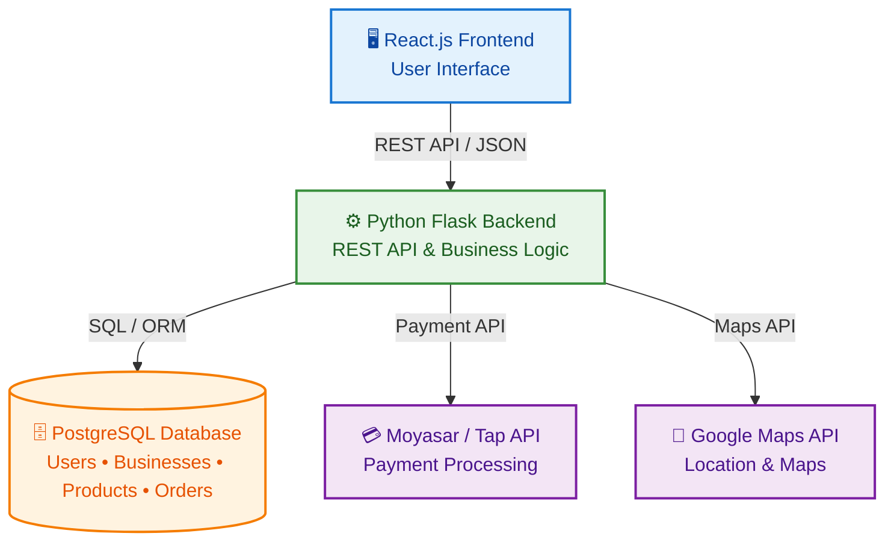
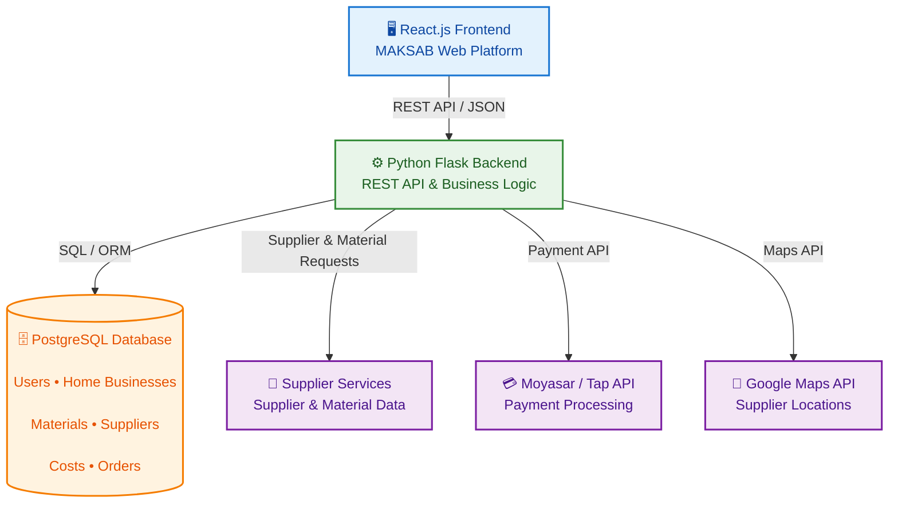

## 🏗️ System Architecture

```mermaid
flowchart TB

    %% Frontend
    A["🖥️ React.js Frontend<br/>User Interface"] 
    
    %% Backend
    B["⚙️ Python Flask Backend<br/>REST API & Business Logic"]

    %% Database
    C[("🗄️ PostgreSQL Database<br/>Users • Businesses • Products • Orders")]

    %% External Services
    D["💳 Moyasar / Tap API<br/>Payment Processing"]
    E["📍 Google Maps API<br/>Location & Maps"]

    %% Main Flow
    A -->|"REST API / JSON"| B
    B -->|"SQL / ORM"| C

    %% External APIs
    B -->|"Payment API"| D
    B -->|"Maps API"| E

    %% Styling
    classDef frontend fill:#E3F2FD,stroke:#1976D2,stroke-width:2px,color:#0D47A1
    classDef backend fill:#E8F5E9,stroke:#388E3C,stroke-width:2px,color:#1B5E20
    classDef database fill:#FFF3E0,stroke:#F57C00,stroke-width:2px,color:#E65100
    classDef external fill:#F3E5F5,stroke:#7B1FA2,stroke-width:2px,color:#4A148C

    class A frontend
    class B backend
    class C database
    class D,E external
```
## 🏗️ MAKSAB System Architecture

```mermaid
flowchart TB

    A["🖥️ React.js Frontend<br/>MAKSAB Web Platform"]

    B["⚙️ Python Flask Backend<br/>REST API & Business Logic"]

    C[("🗄️ PostgreSQL Database<br/>
    Users • Home Businesses<br/>
    Materials • Suppliers<br/>
    Costs • Orders")]

    D["🏪 Supplier Services<br/>Supplier & Material Data"]

    E["💳 Moyasar / Tap API<br/>Payment Processing"]

    F["📍 Google Maps API<br/>Supplier Locations"]

    A -->|"REST API / JSON"| B

    B -->|"SQL / ORM"| C

    B -->|"Supplier & Material Requests"| D

    B -->|"Payment API"| E

    B -->|"Maps API"| F

    classDef frontend fill:#E3F2FD,stroke:#1976D2,stroke-width:2px,color:#0D47A1
    classDef backend fill:#E8F5E9,stroke:#388E3C,stroke-width:2px,color:#1B5E20
    classDef database fill:#FFF3E0,stroke:#F57C00,stroke-width:2px,color:#E65100
    classDef external fill:#F3E5F5,stroke:#7B1FA2,stroke-width:2px,color:#4A148C

    class A frontend
    class B backend
    class C database
    class D,E,F external
```
