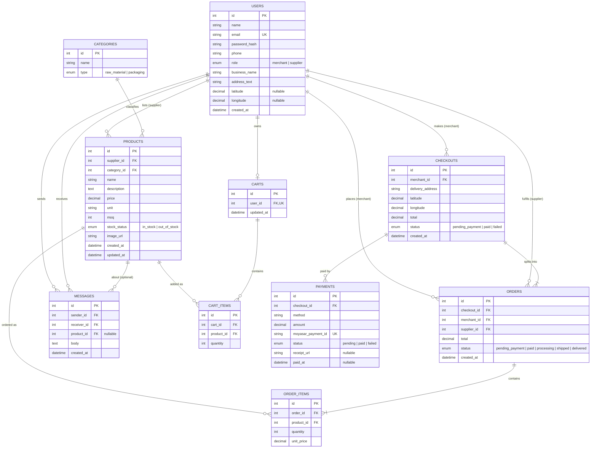
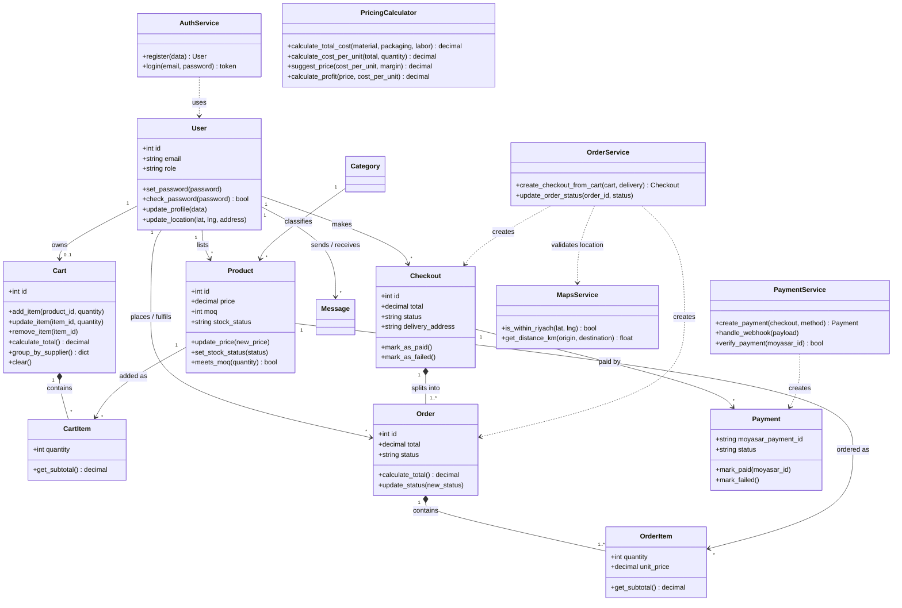
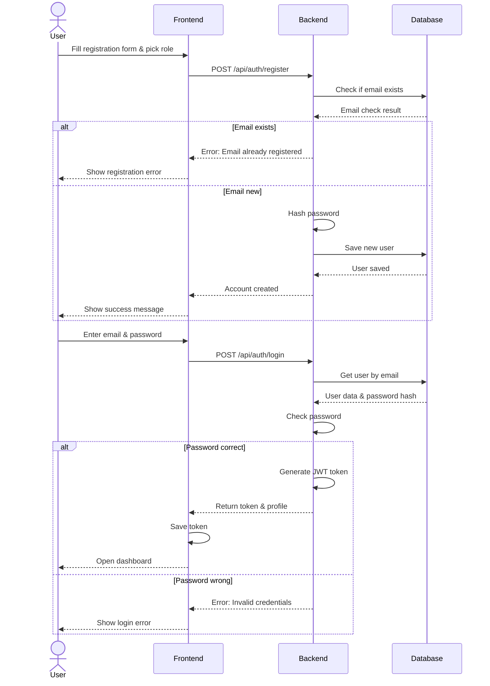
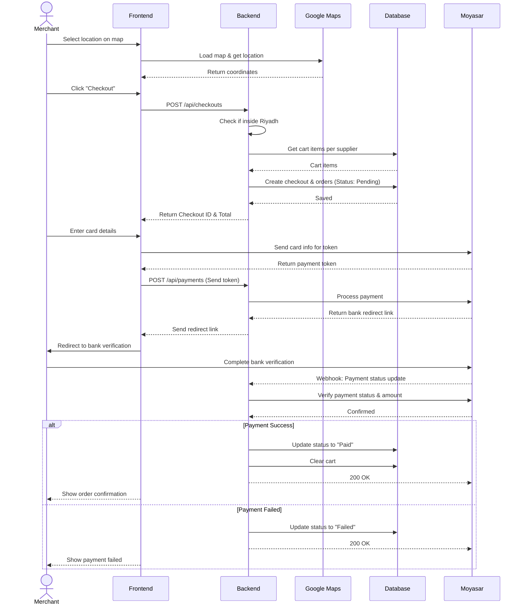
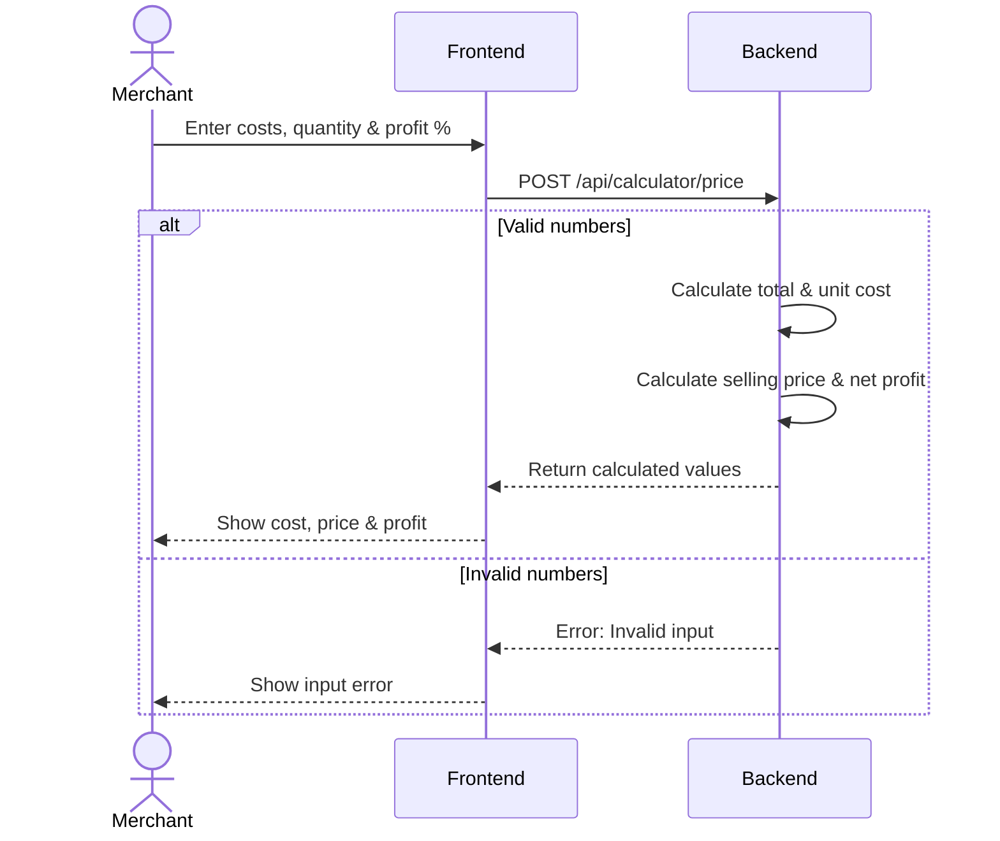

# Stage 3 Report: Technical Documentation

**Portfolio Project – Holberton Saudi Arabia**
**Project:** Maksab (مَكْسَب) – B2B Wholesale Marketplace & Smart Pricing Calculator
**Team:** Reem Alanazi, Bayadir Aldossari, Shomukh Aldosari, Shahad Alharbi
**Document Version:** 1.0

---

## 0. User Stories and Prioritization (MoSCoW)
---


# 1. System Architecture

## Overview
Maksab uses a standard **Three-Tier Architecture** to separate the presentation layer, business logic, and database management. This ensures the system remains organized and easy to maintain.

---

## 1.1 Architecture Components

* **Frontend:** Built with **React.js** as a Single Page Application (SPA). It provides a responsive user interface for both Merchants and Suppliers to manage products, carts, and calculations.
* **Backend:** Built with **Python Flask** and placed behind **Nginx** as a reverse proxy. It handles REST API routing, user authentication (JWT), and core business logic.
* **Database:** Uses **PostgreSQL** with **SQLAlchemy ORM** to manage structured tables for users, products, carts, checkouts, and orders.
* **External Services:**
  * **Google Maps API:** Used for interactive location selection and verifying delivery coordinates within Riyadh boundaries.
  * **Moyasar Payment API:** Used to process credit card payments securely and receive asynchronous updates via webhooks.

---

## 1.2 Data Flow Steps

1. **User Request:** The user interacts with the React frontend (e.g., placing an order, logging in, or running cost calculations).
2. **API Call:** React sends an HTTP request containing a JSON payload and JWT token to Nginx, which routes it to Flask.
3. **Logic Processing:** Flask checks authentication permissions, validates input data, and processes business logic.
4. **Database Query:** Flask interacts with PostgreSQL via SQLAlchemy ORM to fetch or update system records.
5. **JSON Response:** Flask sends back a JSON response to React, which updates the screen immediately.


## 2. Database Design
---

### ER Diagram



### Class Diagram




## 3. Sequence Diagrams
---

This section shows sequence diagrams for 3 key use cases in the Maksab platform.

---

### 3.1 Use Case 1: User Registration and Login

**Description:** This use case is similar to that of a new user with an account on the Maksab platform and their first session the user must first complete the registraton form and select merchant role this user interface sends the data to the backend which checks the database to ensure the email address is not already in use If it is user receives an error message the backend on the other hand records the password and stores the account then when the user starts the corresponding input is verified using the recorded hash and if possible jwt code is generated which the backend stores and sends with each final order We never compared our plan to the script plan because it doesnot expose the entire databas



---

### 3.2 Use Case 2: Checkout and Payment Flow

**Description:** this application explains how sellers process purchas in hopping cart first they enter the delivery addres found on the card and click the checkout button then they verify that the postal code is in riyadh and scan the products in the cart according to the seller they create payment form and enter the details of the paid order for each busine this information is sent directly from the browser to Myasar then forwarded to our payment server the user interface then redirects it to the payment server to create recipient once the bank transfer is complete the seller contacts their bank for confirmation Myasar notifi the payment server via web link that the payment has not been received before check its status myasar then verifies the payment If the payment is confirm all orders are considered paid the cart status changes to fail and the remain balance is deducted the seller is then notified that the payment has not been processed



---

### 3.3 Use Case 3: Pricing Calculator

**Description:** this use case shows how merchant estimates the selle price of product the Merchant enters the material packag and labor costs the number of units produced and the desired profit margin the backend first validates the numbers and if they are invalid it returns an error that the frontend displays otherwise it calculates the cost per unit the suggest sell price and the profit per unit then returns them to be shown on the screen nothing is save since the calculator is stateles



---


# 4. API Specifications

## Overview
All internal endpoints use the base path `/api`. Requests and responses exchange data in standard JSON format. Protected routes require a valid JWT Bearer token in the `Authorization` header.

---

## External Integrations

* **Google Maps API:** Displays map interfaces on the frontend for location pinning and coordinate extraction.
* **Moyasar API:** Manages payment processing, 3D Secure bank redirects, and webhook payment confirmations.

---

## Core API Endpoints

### 1. Authentication
* `POST /api/auth/register` - Registers a new user account (Merchant or Supplier).
* `POST /api/auth/login` - Authenticates user credentials and returns a JWT token.

### 2. Products
* `GET /api/products` - Fetches available products with optional filtering.
* `POST /api/products` - Adds a new product listing (Suppliers only).

### 3. Cart & Checkout
* `POST /api/cart` - Updates or adds items to the active cart.
* `POST /api/checkouts` - Converts cart items into orders and validates Riyadh delivery boundaries.

### 4. Pricing Calculator
* `POST /api/calculator/price` - Calculates material, packaging, and labor inputs to output unit production costs and suggested pricing.

---

## Request & Response Example

### Endpoint: `POST /api/calculator/price`

**Request Payload:**
```json
{
  "material_cost": 20.0,
  "packaging_cost": 5.0,
  "labor_cost": 10.0,
  "quantity": 10,
  "profit_margin": 30
}
```
----
### Response Example (200 OK)

```json
{
  "total_production_cost": 35.0,
  "cost_per_unit": 3.5,
  "suggested_price_per_unit": 5.0,
  "expected_profit_per_unit": 1.5
}
```


## 5. SCM and QA Strategies

## 5.0 Source Control Management (SCM)

We will use Git and GitHub to manage the code for a team of 4 members.

### Branching Strategy
We used a simple strategy to preserve the core code, divided into three sections.


### - `main`
**Purpose:**
This is the final and complete version of the Maksab platform, which will be presented to the evaluators and observers on the day of the presentation.

**Rules:**
1. Direct uploading is not allowed.
2. The code can only be entered through integration and has been previously tested.


### - `development`
**Purpose:**
It is a draft compilation for the four members, so that any member who finishes a part puts it in the development.

**Rules:**
1. Any feature that has been completed in its own branch is integrated into development.
2. After completing the testing of the version located in development, We transfer updates to the main page .


###  - `feature/*`
**Purpose:**
A separate branch is created when starting work on a part of the project, so as not to disrupt other work.


  
**Rules:**
 1. When we finish working on a feature in the feature section, it is integrated into development.
2.  Once merged, it is removed from the feature list.

  
### - `hotfix/*`
**Purpose:**
 An exceptional branch we use only in case of an emergency.

## 5.1 Pull Requests & Code Review

Steps to follow if a member has completed a specific feature and wants to add it to the project:

1. **Open a feature branch:** The member opens a new branch from `development` and works on her part.
2. **Request a Pull Request:** Once she finishes her work, she uploads it to GitHub and requests her code to be merged into the `development` branch.
3. **Code Review:** Another team member checks her work to make sure it is error-free, works correctly, and matches the database and APIs.
4. **Integration and cleaning:** After approval, the work is merged into `development` and the temporary branch is deleted to keep it clean.
5. **Uploading to the final version (`main`):** Uploading from `development` to `main` is only for complete versions and requires approval from the team leaders.

## 5.2 Quality Assurance Strategy
How can we make sure that our website is working correctly and without errors before we display it?


**1. Testing tools we use:**


- **PyTest:** A code we write that automatically tests programming equations (such as calculator calculations and product prices).

- **Postman:** A program we use to test APIs and make sure that the server returns the data correctly.

-  **Manual Testing:** We enter the site ourselves as if we were users, press the buttons, and try each option.
  
**2. Code Quality Tools :**
- Automated tools (such as Flake8 for Python and ESLint for React) scan the code and make sure it is written neatly and cleanly without formatting errors.

**3.Main Test Cases :**
- Login (Merchant/Supplier).
-  The calculator and the effect of correct and incorrect numbers on it.
-  Adding products to the cart and making a mock checkout (Moyasar Sandbox).

 ## 5.3 Deployment Pipeline
 How does the code transfer from team members' devices until it becomes a working website on the internet?

**We have three environments:**

 - **Local (Personal Devices):** Each member writes their own feature
 - **Staging (experimental environment - development):** We collect all member code and upload it to a testing environment.
 - **Production (final location - main):** The approved version %100 that we upload for discussion 
 - **Automated Scanning (CI - GitHub Actions):** We note that as soon as a member uploads their work to GitHub, GitHub automatically checks the code and runs tests, and if everything comes out fine, it allows us to merge it.
 

## Technical Justifications

Here are the main reasons behind our technology choices:

- **React:** Chosen for the frontend due to its component-based structure, which allows us to reuse code and build interactive screens like the pricing calculator and shopping cart easily.
- **Flask & Python:** Flask is a lightweight and simple framework for creating REST APIs, while Python provides clear syntax for writing backend logic and pricing formulas.
- **PostgreSQL:** Selected as our relational database to reliably store structured data, such as users, supplier products, and orders.
- **Moyasar:** Integrated for payments because it supports local payment methods (Mada and Apple Pay) and offers a simple sandbox mode for testing.
- **Nginx & Gunicorn:** Nginx serves as a web server for static frontend files and a reverse proxy, while Gunicorn runs the Flask backend efficiently.


# Final Technical Documentation Summary

This Technical Documentation includes:

* User Stories and Prioritization
* System Architecture
* Database Design
* Sequence Diagrams
* API Specifications
* SCM and QA Strategies
* Technical Justifications

### Team

**Reem Alanazi**
**Bayadir Aldossari**
**Shomukh Aldosari**
**Shahad Alharbi**

### Document Version

**1.0**
