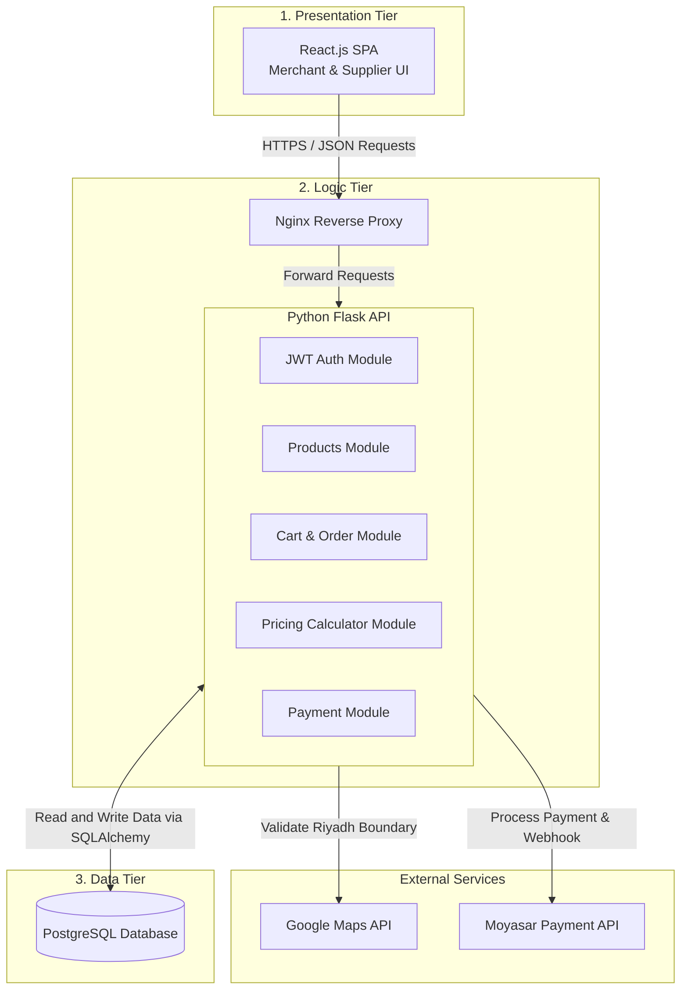

# 1. System Architecture

## Architecture Overview
Maksab platform uses a **Three-Tier Architecture**:

* **Frontend:** Built with React.js (Single Page Application). It gives a fast UI for Merchants and Suppliers.
* **Backend:** Built with Python Flask. It handles the REST APIs, business logic, JWT authentication, and user roles.
* **Database:** PostgreSQL with SQLAlchemy ORM to store users, products, orders, and checkouts safely.
* **Proxy Server:** Nginx sits in front of Flask to handle HTTPS and reverse proxy.

---

## Technical Choices

* **React.js:** Good for interactive components like the pricing calculator and real-time cart.
* **Python Flask:** Lightweight and simple framework to build REST APIs quickly.
* **PostgreSQL:** Reliable relational database for financial transactions and order records.
* **Google Maps API:** Used by Merchants to pin their delivery location on the map.
* **Moyasar API:** Used for Saudi local payments (Mada and Visa).

---

## Data Flow Steps

1. **User Action:** The user performs an action on the React UI (e.g., login or checkout).
2. **HTTP Request:** React sends a REST API request (JSON payload + JWT token) to Flask via Nginx.
3. **Logic Processing:** Flask verifies the user role, checks validation rules (e.g., location inside Riyadh), and handles business logic.
4. **Database Operations:** Flask queries or saves data into PostgreSQL using SQLAlchemy ORM.
5. **Response:** Backend returns a JSON response to update the React interface.
# 1. System Architecture

## Overview
Maksab uses a **Three-Tier Architecture** to separate the user interface, backend processing, and data storage. This setup keeps the application organized and easy to maintain.

---
# 1. System Architecture

## Overview
Maksab uses a **Three-Tier Architecture** to separate the user interface, backend processing, and data storage. This setup keeps the application organized and easy to maintain.

---

## 1.1 High-Level Architecture Diagram

## 1.2 System Components

* **Frontend (React.js):** A Single-Page Application (SPA) used by Merchants and Suppliers to browse products, manage carts, use the pricing calculator, and view orders.
* **Backend (Python Flask & Nginx):** Handles API requests, role authentication (JWT), pricing calculations, and checkout validation. Nginx acts as a reverse proxy to handle incoming HTTP/HTTPS traffic.
* **Database (PostgreSQL):** Stores relational data including users, products, active carts, checkouts, orders, and payment statuses.
* **External Services:**
  * **Google Maps API:** Allows merchants to pin their delivery address and checks if the location is within Riyadh boundaries.
  * **Moyasar API:** Handles online payments and sends status updates back to the backend via webhooks.

---

## 1.3 Data Flow Steps

1. **User Request:** The merchant or supplier interacts with the React interface (e.g., login, add item to cart, or enter cost values in the calculator).
2. **API Communication:** React sends an HTTP request with a JSON payload (and a JWT token if authenticated) to Nginx, which routes it to Flask.
3. **Business Logic Execution:** Flask validates the request data, checks permissions, and performs required operations (e.g., calculating unit production costs or validating checkout coordinates).
4. **Database Query:** Flask interacts with PostgreSQL using SQLAlchemy ORM to fetch or update records.
5. **JSON Response:** Flask returns the JSON result back to React, which dynamically updates the user's screen.
